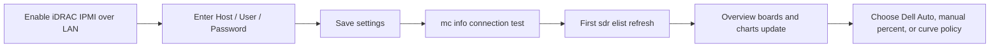
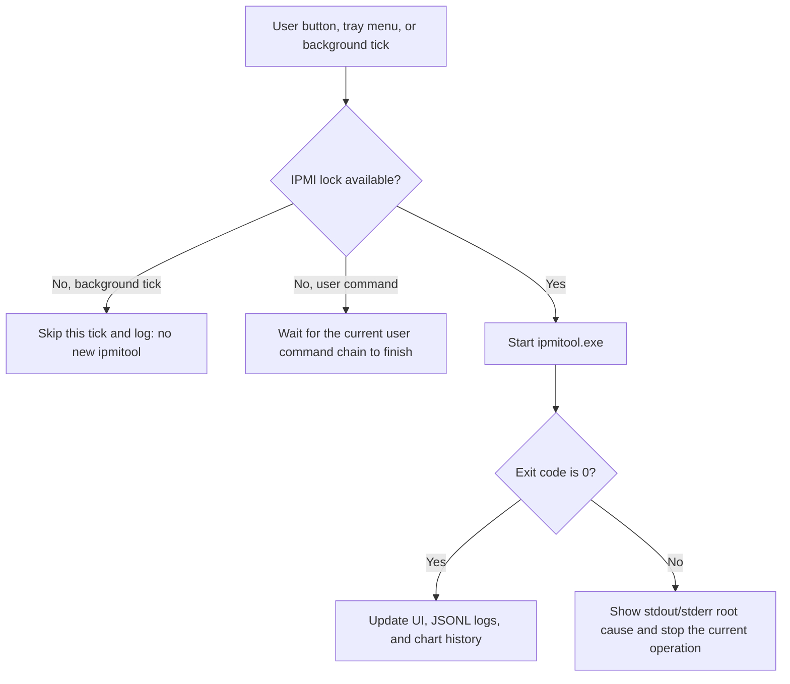
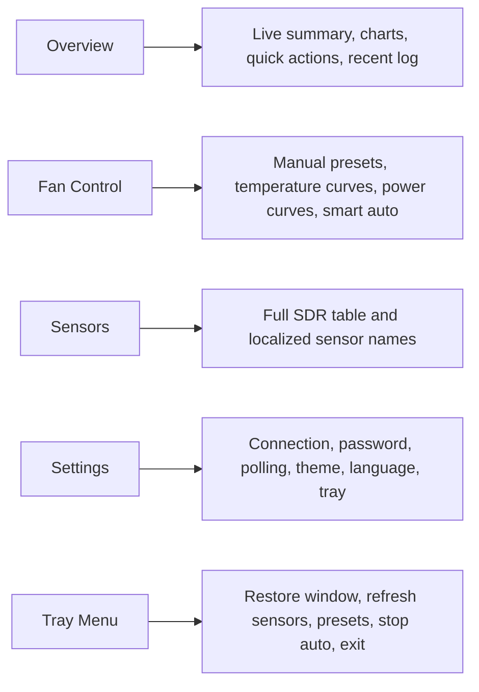

<p align="center">
  
</p>

<h1 align="center">Dell PowerEdge R730xd Fan Control Center</h1>

<p align="center">
  <strong>A Windows GUI for Dell PowerEdge R730xd fan control: manage speeds through iDRAC/IPMI and ipmitool, monitor BMC SDR sensors, and run temperature- or power-based fan curves.</strong>
</p>

<p align="center">
  <a href="README.en-US.md">English</a> |
  <a href="README.md">简体中文</a> |
  <a href="README.zht.md">繁體中文</a> |
  <a href="README.ko.md">한국어</a> |
  <a href="README.de.md">Deutsch</a> |
  <a href="README.es.md">Español</a> |
  <a href="README.fr.md">Français</a> |
  <a href="README.it.md">Italiano</a> |
  <a href="README.da.md">Dansk</a> |
  <a href="README.ja.md">日本語</a> |
  <a href="README.pl.md">Polski</a> |
  <a href="README.ru.md">Русский</a> |
  <a href="README.bs.md">Bosanski</a> |
  <a href="README.ar.md">العربية</a> |
  <a href="README.no.md">Norsk</a> |
  <a href="README.br.md">Português (Brasil)</a> |
  <a href="README.th.md">ไทย</a> |
  <a href="README.tr.md">Türkçe</a> |
  <a href="README.uk.md">Українська</a> |
  <a href="README.bn.md">বাংলা</a> |
  <a href="README.gr.md">Ελληνικά</a> |
  <a href="README.vi.md">Tiếng Việt</a>
</p>

<p align="center">
  <a href="docs/COMMANDS.en-US.md">IPMI Command Reference</a> ·
  <a href="SECURITY.en-US.md">Security</a> ·
  <a href="docs/PROJECT_METADATA.en-US.md">Project Metadata</a>
</p>

<p align="center">
  
  
  
  
  
  <a href="https://github.com/mason369/dell-poweredge-r730xd-fan-control/releases/latest"></a>
  
  
</p>

Dell PowerEdge R730xd Fan Control Center is a Windows WinUI 3 desktop app for managing Dell server fans over iDRAC/IPMI over LAN. It combines `ipmitool raw 0x30 0x30` manual fan speeds, Dell automatic mode, CPU-temperature automation, editable temperature/power fan curves, BMC SDR sensor monitoring, Fan RPM boards, and local history charts. It is intended for homelabs, supervised server-room operation, and R730xd systems whose third-party drives or PCIe devices cause sustained high fan speeds.

The app covers the R730xd/iDRAC behavior documented by this repository. It is not a general server-management suite and does not claim compatibility with every Dell PowerEdge model or firmware. Authentication, privilege, network, runtime-log, WebView2, SDR-parsing, and Dell OEM raw-command failures remain visible in the UI and JSONL logs; the app does not switch backends automatically, label failed work as successful, or fill charts with stale readings.

> [!WARNING]
> Fan raw commands directly change server cooling capacity. The only locally observed hardware environment is a Dell PowerEdge R730xd with iDRAC 2.82. Validate low speeds, automatic curves, and individual fan target selectors while someone is watching the machine. Individual fan control is disabled by default because target selector `0x00` ramped all fans high on the tested server instead of isolating Fan 1.

## Core Capabilities

| Capability | Current behavior |
| --- | --- |
| Manual and firmware control | Set all fans from `0-100%`, save manual presets, or return control to iDRAC/BMC with Dell automatic mode. |
| Automatic fan control | Run the smart CPU-temperature policy or editable temperature-fan and power-fan curves. Automatic mode is shown as running only after the first real SDR read and fan command succeed. |
| BMC hardware monitoring | Run real `mc info` and `sdr elist` commands and display temperatures, Fan 1-6 RPM, power, voltage, current, redundancy, and discrete states. |
| History and visualization | Keep the latest 7 days of successful SDR history in local ECharts/WebView2 charts. Corrupt JSONL is backed up and reported explicitly. |
| Windows operations | WinUI 3 interface, 22 UI languages, tray actions, dynamic presets, themes, and saved running-state restore after connection. |
| Credentials and audit | Pass the password to `ipmitool -E` through `IPMI_PASSWORD`, optionally protect it with current-user Windows DPAPI, and write command timing plus failures to local JSONL. |

## Download And Project Status

| Area | Current state |
| --- | --- |
| Windows download | [Latest GitHub Release](https://github.com/mason369/dell-poweredge-r730xd-fan-control/releases/latest). Download `DellR730xdFanControlCenter-win-x64.zip`, extract the entire archive, and run `DellR730xdFanControlCenter.exe`. |
| Current source version | App version `1.1.0`; assembly, file, and MSIX Identity version `1.1.0.0`. Use the matching Release tag and executable file version for a packaged download. |
| Current GitHub Release | `v1.1.0` is rebuilt by GitHub Actions from its matching committed tag; the release zip contains exe/dll file version `1.1.0.0`. Do not update only the Release title or reuse older binaries. |
| Release format | The primary download is an unsigned, unpackaged, self-contained zip; it does not require MSIX installation. Windows may show a security warning because the executable is unsigned. |
| Local packaging | `tools/Publish-ReleaseZip.ps1` first cleans the dedicated `artifacts/release` output, then creates `DellR730xdFanControlCenter-win-x64.zip` and verifies runtime, license, chart, ipmitool, and forbidden package-identity/WebView2 content. Zip, verification, and signed-MSIX output paths must resolve inside the repository; an out-of-root path fails before creation or recursive cleanup. |
| Target hardware | Dell PowerEdge R730xd. Only SDR timing and selected raw behavior on R730xd / iDRAC 2.82 have been observed locally; other firmware requires supervised validation. |
| Local data | Settings, logs, chart history, and WebView2 data are written under `%LocalAppData%\DellR730xdFanControlCenter`. |
| Verification entry points | `Tests/PresetModelTests`, the x64 Release build, release-zip verification, and supervised checks on the target R730xd/iDRAC. |

## Quick Links

| Goal | Entry |
| --- | --- |
| Download the Windows build or check source version | [Download And Project Status](#download-and-project-status) |
| See what the app does | [Feature Overview](#feature-overview) |
| Connect to iDRAC for the first time | [First-Run Workflow](#first-run-workflow) |
| Build or run locally | [Build](#build) / [Run](#run) |
| Run tests, package, and release verification | [Verification](#verification) / [Publish](#publish) |
| Review raw commands and fan target selectors | [IPMI Command Reference](docs/COMMANDS.en-US.md) |
| Check credential, log, and supply-chain risks | [Security](SECURITY.en-US.md) |
| Read the maintainer-facing project summary | [Project Metadata](docs/PROJECT_METADATA.en-US.md) |
| Review license and third-party notices | [License](#license) / [Third-party notices](THIRD_PARTY_NOTICES.md) |
| Troubleshoot sensors, polling, charts, or tray behavior | [Troubleshooting](#troubleshooting) |
| Contribute or report an issue | [Maintenance And Contribution](#maintenance-and-contribution) |

## 5-Minute Quick Start

Use this path when the iDRAC address, username, and password are already known and the goal is a basic sensor and fan-control check.

1. Enable **IPMI over LAN** in iDRAC and confirm that the current Windows machine can reach the iDRAC management network.
2. Download `DellR730xdFanControlCenter-win-x64.zip` from [GitHub Releases](https://github.com/mason369/dell-poweredge-r730xd-fan-control/releases/latest), extract the entire archive, and run the executable. Developers can also start from source:

   ```powershell
   cd C:\DellR730xdFanControlCenter
   dotnet run --project .\DellR730xdFanControlCenter.csproj -c Debug -p:Platform=x64
   ```

3. First launch opens Settings. Enter the iDRAC/BMC address, username, and password. Enable "Remember password with DPAPI" only when later automatic connection is required.
4. Click "Save settings". The app runs a real `mc info` connection test, then one `sdr elist` refresh, and starts persistent polling only after those succeed.
5. Return to Overview and confirm real readings for CPU/inlet/exhaust temperatures, Fan 1-6 RPM, power, voltage, current, and state cards.
6. Start with "Restore Dell factory fan speed" or conservative 20%/35% manual speeds before testing lower speeds. Low fan speeds, individual target selectors, and curve-auto policies should be validated gradually while someone is watching the machine.
7. To hand control back to BMC, click "Restore Dell factory fan speed". Before waiting for the IPMI lock, this action stops smart auto or curve auto, then sends Dell automatic mode; no separate "Stop auto" click is required.



## Running App Interface

The image below is an actual running app screenshot. It shows the interactive visualization page, history-range filters, temperature/fan/performance/electrical charts, and visible status feedback. The values shown come from the local R730xd validation environment and are examples of the UI and data flow; different workloads, iDRAC firmware, fan walls, drive counts, and ambient conditions produce different readings.


## Visual Workflows

### Commands And Failure Handling



### Pages And Common Entrypoints



## Multilingual Docs And UI

- README language entries: [English](README.en-US.md), [简体中文](README.md), [繁體中文](README.zht.md), [한국어](README.ko.md), [Deutsch](README.de.md), [Español](README.es.md), [Français](README.fr.md), [Italiano](README.it.md), [Dansk](README.da.md), [日本語](README.ja.md), [Polski](README.pl.md), [Русский](README.ru.md), [Bosanski](README.bs.md), [العربية](README.ar.md), [Norsk](README.no.md), [Português (Brasil)](README.br.md), [ไทย](README.th.md), [Türkçe](README.tr.md), [Українська](README.uk.md), [বাংলা](README.bn.md), [Ελληνικά](README.gr.md), and [Tiếng Việt](README.vi.md).
- Compatibility entry: [README.zh.md](README.zh.md) points readers to the default Simplified Chinese README. The full long-form manuals are maintained in [README.md](README.md) and this file [README.en-US.md](README.en-US.md); other language README files provide real localized entry pages for core use, safety, and verification instead of dead language-switch links.
- 中文配套文档: [IPMI 命令参考](docs/COMMANDS.md), [安全说明](SECURITY.md), [项目元数据](docs/PROJECT_METADATA.md).
- English companion docs: [IPMI Command Reference](docs/COMMANDS.en-US.md), [Security](SECURITY.en-US.md), [Project Metadata](docs/PROJECT_METADATA.en-US.md).
- The app includes 22 UI languages. Open Settings, choose a language in the UI language dropdown, and save; visible UI switches immediately. Existing JSONL runtime logs keep their structured fields and original runtime semantics, and are not rewritten into another language.

## Scope

- Target server: Dell PowerEdge R730xd.
- Target control plane: iDRAC/BMC IPMI over LAN.
- Target OS: Windows 10 2004 / build 19041 or newer.
- Target users: homelab operators, server caretakers, dense-drive R730xd owners, and noise-constrained environments that still need visible thermal control.
- Locally observed environment: R730xd / iDRAC firmware 2.82. Documentation and default configuration use reserved example host `192.0.2.10` and example user `idrac-user`; real private addresses and accounts should not be committed to the repository.

Different iDRAC firmware versions, backplanes, fan layouts, and sensor layouts can change individual fan target-selector behavior. Fan 1-6 target selectors are implemented in code but disabled by default; `0x00` is a target selector in the firmware raw command, not `0%` fan speed, so verify your firmware mapping before enabling them.

### Usage-Scope Photos

The photos below show the actual Dell PowerEdge R730xd chassis environment this project targets, including dual CPU heatsinks, the front fan wall, expansion-card area, and chassis airflow path. They document the hardware scope of the app; they do not imply that every R730xd has the same backplane, cards, drive count, cable routing, or iDRAC SDR sensor names.


## Feature Overview

- Modern WinUI 3 interface with light, dark, and system theme support.
- All-fan percentage control from 0-100%; the app enters manual fan mode before setting a percentage.
- If manual-mode entry succeeds but the immediately following all-fan or individual-fan percentage raw command fails, the app sends one Dell automatic recovery command to reduce the risk of leaving the BMC in manual mode at a stale speed. The failed percentage command is never retried. A successful recovery still leaves the requested operation failed, while the UI and LastRunning move to Dell Auto. If recovery also fails, both exceptions are retained and the app explicitly warns that hardware mode cannot be confirmed.
- The built-in Default/Restore Manual preset keeps manual mode plus all fans at 10% for users who explicitly choose that preset as a local quiet baseline.
- Starter presets: Default 10%, Balanced 20%, Cooling 35%, Performance 50%, and Dell Auto.
- Edit preset names, descriptions, and available percentages; add, save, and delete manual percentage presets. Starter presets can also be deleted; the deletion is written to `settings.json`, the next launch does not re-seed them, and starter presets return only when the settings file is removed or recreated.
- Add and edit temperature-fan and power-fan curve presets. Both editors support chart clicks, live point dragging, and right-side numeric fine tuning. Version 1.0.15 adds axis ticks, a filled plot, and a fixed out-of-canvas hover readout so guides do not cover or intercept the pointer; Smooth mode uses monotone cubic interpolation without overshoot, followed by continuous all-fan control after switching to the preset.
- Dell automatic fan mode remains available as both a separate action and a preset entry. It stops any running software auto policy before waiting for the IPMI lock, sends the command that hands fan control back to iDRAC/BMC, clears curve/smart-auto state, and writes Dell Auto as the current running preset.
- Individual target-byte control for fans 1-6 is implemented but disabled by default.
- The software auto policy reads BMC SDR. The global policy and temperature curves use CPU temperature; power curves use the power sensor whose unit is `Watts` or whose key contains `Pwr Consumption`, while still checking the CPU emergency temperature threshold first.
- At the emergency temperature threshold, the smart auto policy sends the Dell automatic mode command. After that command succeeds, the app stops the software auto timer, clears the active curve/smart-auto state, writes Dell Auto as the persisted running mode, and shows a visible warning.
- Clicking "Start polling" or successfully saving settings tests the iDRAC connection, reads SDR once, and starts persistent SDR polling only after the `SensorPollingStarted` record has been durably flushed. "Connected and polling" is shown after that flush. If the record cannot be written, the timer is not started and the UI shows the logging root cause. Polling has a 1-second default interval. While polling is active, the same command reads "Cancel polling"; clicking it stops future sensor polling ticks and any pending reconnect retry. If an `ipmitool` command is already in flight, that command is allowed to finish and the app does not start a new tick. Only one IPMI operation is allowed at a time, so a tick is skipped when the previous poll is still running, and no new `ipmitool` process or RMCP+ session is started for that skipped tick. When a background sensor polling command fails, the app first stops the current poll, shows and logs the original failure, then keeps running real reconnect attempts (`mc info` + `sdr elist`) at the configured polling interval. Polling resumes only after one reconnect succeeds. If reconnect fails, the app stays disconnected, keeps showing the root cause, waits for the next reconnect attempt, and does not write chart history that has no real SDR source. If a transient error such as `Unable to establish IPMI v2 / RMCP+ session` is followed by a real successful `sdr elist` refresh, the stale top failure banner is closed while the original failure remains in the JSONL runtime log.
- After a manual preset, Dell Auto, temperature curve, power curve, or smart temperature policy starts successfully, the running state is written to `%LocalAppData%\DellR730xdFanControlCenter\settings.json`. On the next app launch, after a real connection/start-polling sequence succeeds, the app re-executes the saved preset or automatic policy. Restore failures show the real error instead of only marking the UI as running. Smart auto and curve auto mark the hero, mode card, and active preset as automatic only after the first real tick succeeds; start failure, Stop Auto, emergency Dell Auto protection, or raw fan-command failure after a computed target clears those automatic-mode states. SDR-read failure before target computation on an already-running auto timer remains visible but keeps the selected automatic policy for the next scheduled tick.
- User-triggered fan commands wait for the current IPMI command to finish before continuing, so switching presets no longer shows the "IPMI command is already running" busy error. Background polling ticks, smart-auto ticks, and curve-auto ticks still skip while IPMI is busy to avoid accumulating queued commands.
- While smart auto or curve auto is running, the regular sensor polling timer does not start a second independent `sdr elist` sampling path. Each auto-policy tick reads SDR, updates the sensor list, dashboard boards, interactive charts, and JSONL chart history. After auto policy is stopped, regular polling continues on the configured cadence.
- Smart auto and curve auto remember the most recent all-fan percentage successfully sent by the same automatic mode. If a later tick computes the same percentage from the current temperature or power reading, it logs "No fan command sent" and still refreshes sensors/charts, but it does not resend the same Dell raw fan-control command. Switching automatic modes, restoring the last running automatic policy, manual all-fan control, individual fan control, Dell Auto, or Stop Auto clears this cache; the first tick of a newly started automatic policy sends the computed target percentage once even when it matches the last in-memory percentage, so an app restart, tray-background session, or external iDRAC action cannot make the app assume the BMC is already at that target.
- Every real `ipmitool` command, including Dell fan-control raw commands (`raw 0x30 0x30 ...`), fails immediately on a non-zero exit code and shows stdout/stderr. The app does not mark a failed raw fan command as successful and never resends the same failed command. The only fan-safety closure is one different Dell automatic recovery command after confirmed manual-mode entry followed by a failed percentage command. Persistent background recovery is limited to sensor polling failures: the app runs visible real reconnect attempts (`mc info` + `sdr elist`) until polling is restored or the user cancels polling, without reapplying the saved fan preset or automatic policy.
- After a user-triggered fan command succeeds, including all-fan control, individual fan control, manual presets, restore-manual presets, and Dell automatic mode, the app immediately runs one more `sdr elist` read and uses the real BMC response to refresh the fan RPM board, power/state board, interactive charts, and JSONL chart history point. If that refresh fails, the real error is shown; the app does not treat the just-sent percentage as a sensor reading. After the refresh succeeds, the next polling timer interval is restarted from that completion time so the original tick does not immediately duplicate the same read.
- Bundled `ipmitool.exe` and required Cygwin DLLs under `BundledTools/ipmitool`. At launch the app normalizes the process current directory to the application directory, and runtime command execution resolves the bundled tool from the application directory; launching from a Windows Start Menu shortcut whose working directory is `%AppData%\Microsoft\Windows\Start Menu\Programs` does not make the app look for `BundledTools` under the Start Menu folder.
- At launch the app acquires its per-Windows-session single-instance mutex before scanning same-name processes with a different file version. This ensures that two simultaneous launches of the same version leave one mutex winner running instead of making both processes reject each other. If an older build, newer build, or second same-version window is still running, the new launch writes `%LocalAppData%\DellR730xdFanControlCenter\startup-error.log`, shows a dialog with the existing instance or process ID, and stops that launch with exit code `2`. This prevents multiple instances from writing `settings.json` or sending concurrent IPMI fan commands. When switching builds or verifying a new package, exit the old window and tray instance before launching from Start Menu or a publish directory.
- Bundled local ECharts dashboard assets under `Assets/Charts/dashboard.html` and `Assets/Charts/echarts.min.js`; runtime does not depend on an online CDN.
- The Overview interactive charts store a complete chart snapshot after each successful SDR poll and persist it under `%LocalAppData%\DellR730xdFanControlCenter\chart-history\chart-history-YYYYMMDD.jsonl`. The chart header's "History range" control switches between Current, Last 6 hours, Last 1 day, Last 3 days, Last 7 days, and Custom. History files are retained for the latest 7 days by default, and the app reloads retained points after restart. If a history JSONL file contains a corrupt row, such as `0x00` bytes left by an interrupted write or a partial JSON line, startup shows the real load failure, preserves the original file as `*.corrupt-*.bak` in the same directory, and rewrites the active `chart-history-YYYYMMDD.jsonl` with the rows that still parse so the next startup does not fail on the same row again.
- Tray icon supports background operation. Its right-click menu keeps page entry points, refresh sensors, open iDRAC, open logs, stop auto policy, Restore Dell factory fan speed, all-fan 20/35/50%, and preset switching mostly at one level; dynamic presets remain a single submenu. The tray restore action sends Dell automatic mode and does not switch to manual 10%. Exceptions from tray settings loading, menu construction, synchronous actions, or asynchronous commands are routed to the main-page failure surface and runtime log. A rejected DispatcherQueue enqueue is reported explicitly instead of dropping the click.
- iDRAC web console shortcut opens `https://<host>/`.
- All visible UI strings are wired to localization resources. The app now includes 22 interface languages: English, 简体中文, 繁體中文, 한국어, Deutsch, Español, Français, Italiano, Dansk, 日本語, Polski, Русский, Bosanski, العربية, Norsk, Português (Brasil), ไทย, Türkçe, Українська, বাংলা, Ελληνικά, and Tiếng Việt. The language selector shows each option in that language's own native name instead of translating every language name into the current UI language; the MSIX package manifest display name and description are also localized through `Strings/<language>/Resources.resw`, so Start menu, package metadata, and shell surfaces do not keep fixed Chinese or English text. Technical identifiers such as `Dell`, `PowerEdge`, `R730xd`, `iDRAC`, `IPMI`, `BMC`, `SDR`, `CPU`, `RPM`, `OEM`, `RMCP+`, `ipmitool`, `WebView2`, `ECharts`, `DPAPI`, and `JSONL` remain unchanged, as do units such as `°C`, `s`, `W`, `V`, `A`, and `%`; backend JSONL logs and internal runtime records keep Chinese/structured internal semantics and are not converted through UI localization.
- Charts, dashboard cards, and the Sensors table's Sensor column use localized display names. Registered SDR names are translated into the current UI language; unregistered English or vendor names keep the original BMC key and are not rewritten as a generic event without a real source. The raw key still drives internal classification and matching; run `ipmitool sdr elist` manually when the complete original output needs to be compared.
- The Overview interactive chart runs in WebView2, but mouse-wheel events are forwarded to the outer WinUI `ScrollViewer` for page scrolling. Discrete mouse-wheel input is first normalized into wheel ticks, then converted to a fixed page-scroll distance and applied through `ChangeView` with WinUI scroll animation preserved. This avoids speed drift from raw browser pixel deltas and avoids the jumpy motion caused by directly invoking the wheel presenter. Touchpad-style high-frequency small deltas still move by the coalesced pixel distance. ECharts internal wheel zoom is disabled, and history ranges are still adjusted with the bottom slider, so scrolling over the chart should not trap the page, jump instantly, or use a visibly different speed from the upper content.
- The main window and chart page adapt to Windows DPI scaling, window width, and narrow layouts. `app.manifest` declares `PerMonitorV2`; `MainPage.xaml.cs` switches Small, Medium, and Large layouts from effective pixel width on startup and every window-size change; and `Assets/Charts/dashboard.html` also reads container width plus `window.devicePixelRatio` before laying out charts. This adaptation does not require a Settings toggle, and failures do not create charts or layout-success states without a real load result.
- Passwords can be stored with Windows DPAPI under the current Windows user context.
- Runtime logs are written as JSON Lines to `%LocalAppData%\DellR730xdFanControlCenter\logs\runtime-YYYYMMDD.jsonl`; each line is a complete atomic event, including user commands, sensor refreshes, smart auto ticks, and IPMI command timing.
- Startup exceptions are written to `%LocalAppData%\DellR730xdFanControlCenter\startup-error.log`.

## Screens

### Resolution, DPI, And Window Scaling

The main UI adapts automatically at app startup and after every window-size change; users do not need to enable an extra Settings switch.

- Entry points and scope: adaptation covers Overview, historical charts, Quick Actions, Temperature Board, Fan RPM Board, Power & Health, Fan Control, curve editors, Sensors table, and Settings. The tray menu remains a native Windows menu rendered by the operating system for the current DPI.
- Default configuration: `app.manifest` uses `PerMonitorV2` DPI awareness, and the app switches layout by WinUI effective pixels instead of physical resolution. The current `MainPage.xaml.cs` breakpoints are `<641` for Small, `641-1007` for Medium, and `>=1008` for Large.
- Execution flow: `MainPage.OnPageSizeChanged` calls `ApplyResponsiveLayout`, then reflows the hero, overview metric cards, quick actions, all-fan controls, preset editor, temperature/power curve editors, smart-auto controls, and Settings command bar. Small layout changes `NavigationView` to top navigation; Medium and Small layouts let temperature, fan, and power/health boards use page scrolling instead of fixed-height clipping.
- Chart flow: the Overview WebView minimum height is `1520` in Large layout and `3200` in Medium/Small layout so historical chart panels are not covered by following content. `Assets/Charts/dashboard.html` adjusts grid, legend, axis margins, and line rendering from container width, chart count, and `window.devicePixelRatio`. Chart labels do not use ellipsis as the normal display strategy.
- Success behavior: on narrow windows or high DPI, cards, command bars, charts, and tables should show complete content through wrapping, reflow, or outer page scrolling. The UI should not show bottom divider lines through content, hidden charts, crowded button text, abbreviated performance/electrical labels, or horizontal page overflow.
- Failure behavior: if WebView2 resources, chart scripts, or local chart assets fail to load, the top error and runtime log show the real failure. The app does not use blank images, data without a real source, or silent downgrade behavior to show charts as ready.
- Verified scope: the current repository static checks include `RunContentScrollWidthXamlChecks`, `RunDpiTextWrappingXamlChecks`, and `RunDashboardChartLayoutChecks` in `Tests/PresetModelTests/Program.cs`. Local manual validation covered Windows window sizes `640x900`, `920x900`, and `1366x900`, plus chart-page equivalent DPR `1.0`, `1.25`, `1.5`, `1.75`, and `2.0`. That validation record is not a guarantee that every remote-desktop, GPU-driver scaling, or third-party window-manager combination is identical; when reporting an issue, include the Windows scaling percentage, window size, screenshot, and runtime log.

### Overview

The Overview page is for observing hardware state and running common actions:

- The hero live summary shows current temperature, average fan RPM, live power, average voltage, and total current from the latest successful SDR sensor refresh. Under each large value, the app shows every concrete sensor detail for that category on separate lines, such as all inlet/exhaust/CPU temperatures, Fan 1-6 RPM, power consumption, all voltage rails, and all current rails; it no longer truncates the hero details to the first three items. The live summary cards have a taller baseline and grow with the actual number of returned sensors, so systems with more fans or electrical rails display those additional rows. Before the first refresh, or when one sensor category is missing, that value shows "Waiting". The temperature summary uses the average of the latest temperature sensor readings, not a historical maximum; the overview card and emergency automatic protection keep their separate max/CPU temperature semantics. Large values and details are color-coded by recommended live ranges: normal green, near-risk yellow, clear deviation orange, and danger red. Current thresholds are temperature `<60/60-69/70-79/>=80 °C`; average RPM `2500-6000` green, `1500-2499 or 6001-9000` yellow, `500-1499 or >9000` orange, `<500` red; power `<500/500-699/700-899/>=900 W`; voltage `210-240` green, `200-209 or 241-250` yellow, `190-199 or 251-260` orange, otherwise red; and total current `<4/4-5.9/6-7.9/>=8 A`. These colors are UI hints only and do not replace the full sensor table, iDRAC alerts, or emergency automatic protection.
- Under the title, the left side of the hero shows a "Current thermal mode" badge that explicitly names whether the app is idle, in manual control, Dell automatic thermal control, the smart temperature policy, temperature-curve auto, or power-curve auto. Preset switches, start/stop auto actions, and auto ticks that update the current percent keep this badge in sync with the right-side status card.
- The right-side hero status card shows the current iDRAC target, connection state, current control mode, latest request status, and last update time.
- Latest request status updates in real time for Switch actions, start/cancel polling, refresh sensors, save settings, start/stop smart auto, curve auto ticks, and polling success/skip/failure. The hero card shows compact states such as "Requesting", "OK", "Skipped", "Failed", and "Applied"; the complete reason remains visible in the top InfoBar and runtime log.
- Metric cards show max CPU temperature, fan state, live power, average voltage, total current, and current control mode. Power, voltage, and current also come from the latest successful SDR refresh and show waiting/no-reading text when absent.
- Interactive visualization is built around historical ranges: the overview trend shows max temperature, average fan RPM, CPU/memory/I/O/system usage, and power; the range profile compares range average, range peak, and range latest; the temperature and fan charts show every valid sensor in those categories; the performance/electrical chart shows valid CPU, memory, I/O, system usage, power, voltage, and current over time; and the health chart shows OK and attention counts. Every successful poll saves display-valid summary, current readings, type counts, and sensor tree data as a JSONL point with `timestamp` and `unixMilliseconds`; failed polls, skipped ticks, or polls without new SDR data do not create history points without a real SDR source. History load or write failures are shown as top errors and written to the runtime log.
- Temperature Board shows every temperature sensor reported by BMC SDR, with temperature icons and live recommended color states. Card subtitles label SDR metadata as compact text such as "ID 0x30 / Location 7.1"; raw `30h` is converted to `0x30` so it is not mistaken for hours, and `7.1` is the IPMI entity/instance location.
- Fan RPM Board shows current RPM readings for fan sensors, with a fan icon that rotates continuously. The animation period is derived from RPM: higher RPM rotates faster, while zero or missing readings are not shown as normal high-speed motion. Fan cards use the same "ID 0x30 / Location 7.1" subtitle instead of bare `30h · 7.1` values.
- Power & Health shows every valid non-temperature/non-fan item from the latest real `sdr elist`, including CPU / MEM / IO / SYS usage, power, voltage, current, redundancy, batteries, drive presence, RAID/PERC, cache, intrusion, and Power Optimized. Drives, RAID controllers, and cache have distinct icons, but appear only when the current BMC result contains a valid row. The app does not synthesize missing BBU capacity, cache hit rate, or RAID performance values. The board has no item limit; long state values wrap and keep labeled ID/location metadata.
- Temperature, Fan RPM, Power & Health, and the detailed sensor list disable their internal vertical scrollbars, leaving the outer WinUI `ScrollViewer` as the single page scroll owner. Native content and the chart WebView feed mouse-wheel input into the same tick distance, coalescing queue, and animated `ChangeView` path. ECharts still uses the bottom slider for history range selection and does not consume page-wheel input.

- Quick Actions include refresh sensors, Restore Dell factory fan speed, open iDRAC, and all-fan percentage control. Start/stop controls for the smart auto policy now live on the Fan Control page.
- Recent Log shows command results, success/failure state, and polling warnings, and includes an "Open logs" entry point. UI status badges are color-coded by level: info is blue, warning is amber, success is green, and only error/failure uses red; the local JSONL runtime log still writes plain structured fields and does not store color values.

#### Icon and motion semantics (1.0.14)

- The entry points are the Overview Temperature Board, Fan RPM Board, and Power & Health board. Sensors map to temperature, CPU / MEM / IO / SYS usage, power, voltage, current, intrusion, fan/power redundancy, CMOS / ROMB / BBU battery, drive, RAID/PERC controller, cache, USB over-current, power-policy, or generic-state icons. An unrecognized real sensor with `ok` status uses the green generic normal icon; explicit warning or critical status still takes priority. Rows with `ns`, `na`, `No Reading`, `Disabled`, `Not Available`, `N/A`, `Unknown`, or a non-finite numeric value do not enter boards, the details list, or charts. Real warning/critical discrete status remains visible even without a numeric value. Each card also has a non-color state badge, and its screen-reader name includes value, semantic state, and disconnected state.
- The dashboard fan keeps its four-blade cross shape and rotates around its center. The navigation icon is now a static circular fan housing with four curved blades, so it no longer reads as a diagonal X and is not presented as an RPM indicator. Zero RPM stops. Positive RPM motion uses only the latest successful `sdr elist` reading and maps RPM linearly to rotations per second, with a low-end single-rotation period cap of `5.2 s` and `0.11 s` at 18000 RPM or above, so 3600 RPM is slightly faster than 3480 RPM. A speed update changes playback rate without resetting the current angle.
- Temperature and CPU / MEM / IO / SYS levels, plus the known `Voltage N` gauge needle, make one transition only when a real new sample changes. The trusted known-voltage gauge range is `190..260 V`. A vendor sensor recognized only through a `Volts`, `Amps`, or `Watts` unit keeps the matching icon but uses Information and a static neutral presentation; where the voltage gauge applies, its needle sits at the midpoint. The app does not assume a 230 V range or current/power thresholds. Non-finite values, `No Reading`, and `Unknown` are explicitly Unavailable.
- Positive current has subtle flow and positive power has subtle activity. A normal health state stays static; only warning and critical states pulse. Motion represents the latest successful SDR result and does not interpolate or invent values between polls. Stopped polling, a disconnected or stale snapshot, 0 RPM, disabled state, or no reading stops motion and leaves a static clock/shape state. Turning off Windows animations, enabling high contrast, or hiding the window to the tray also stops motion; it resumes after the window is visible and animations are allowed. High contrast uses the system foreground color at full opacity.
- Classification checks exact raw SDR keys before falling back to units and real-name patterns. Abnormal status codes take priority over numeric styling, and unknown ranges are not guessed. An unknown valid vendor key keeps the BMC-provided name instead of being replaced with a fabricated generic event title. A Dispatcher callback or Composition update failure raises `VisualUpdateFailed`; MainPage routes it through `ShowFailure`, opens the error bar, and writes the runtime log instead of marking animation successful. If the control has no error handler, it throws explicitly; when unhandled, the global exception logger writes `%LocalAppData%\DellR730xdFanControlCenter\startup-error.log` and the process may terminate. The implementation is in `Models/SensorReadingAvailability.cs`, `Models/DashboardSensorPresentation.cs`, `Models/DashboardSnapshotFreshness.cs`, `Controls/DashboardSensorIcon.xaml(.cs)`, and `MainPage.xaml`. Filtering creates display copies only; it does not change the raw SDR collection used by automatic fan control, IPMI commands, polling, policies, or settings.
- Run `dotnet run --project .\Tests\PresetModelTests\PresetModelTests.csproj -c Release` to check classification, states, motion boundaries, and source constraints, then run `dotnet build .\DellR730xdFanControlCenter.csproj -c Release -p:Platform=x64` for the x64 Release build. The test program does not read the prose in README, `SECURITY`, or `docs`, so paired documents still require a separate review. Animation is not a control loop or safety alarm; use the complete sensor table and iDRAC alerts as the source of hardware status. BMC/firmware naming differences can place a sensor in unit-only or generic handling, and actual update timing depends on the duration of a full `sdr elist` read. Local checks do not claim manual coverage of every iDRAC firmware, Windows display scale, or high-DPI combination.

### Fan Control

The Fan Control page manages presets and advanced control:

- The preset area shows the current mode, starter presets, custom presets, and editable descriptions.
- Manual presets send Dell OEM raw commands for all-fan percentage control.
- Default/restore and manual presets can edit their percentage. The Overview quick restore and tray restore actions now restore Dell factory fan speed by sending Dell automatic mode instead of manual 10%.
- The Dell Auto preset restores the BMC firmware fan policy and does not expose a percentage field.
- The Smart Auto Policy start/stop card lives on the Fan Control page. Target, high, and emergency temperature thresholds no longer have an in-app editing entry point; the policy continues using values already stored in the settings file or the code defaults. Polling seconds are saved from the Settings page's Application area. Each tick writes runtime log records and updates the hero request status.
- Adding a manual preset requires a name and validates the percentage from 0-100.
- Curve presets are maintained with graphical editors instead of multiline text boxes. The temperature editor stores `TemperatureCelsius` + `FanPercent`; the power editor stores `PowerWatts` + `FanPercent`. After entering a name, click empty chart space to add a point; dragging updates the point and matching numeric control live. The plot has full axis ticks, a translucent area layer, and 120-sample continuous preview rendering. On hover, the canvas keeps only non-hit-testable crosshair and marker shapes; the current temperature/power and computed curve percentage appear in a fixed row below the chart, never on top of the operation point. Title-adjacent how-to paragraphs and the right-side ASCII preview are removed. When idle, the row shows point and input/output ranges; invalid points show the real validation reason there. "Edit points" loads the matching editor and scrolls to it; a successful save scrolls back to the added or updated preset card.
- The temperature editor starts with `45 °C = 18%`, `68 °C = 28%`, and `78 °C = 42%`; the power editor starts with `280 W = 18%`, `500 W = 28%`, and `750 W = 42%`. These defaults only seed a new editor and do not overwrite saved presets.
- Saving a curve requires at least 2 points. Temperature curves require temperatures from `-40` to `125` C, fan percentages from `0` to `100`, and no duplicate temperatures; power curves require power from `0` to `1200` W, fan percentages from `0` to `100`, and no duplicate power points. Invalid points show the validation reason in the fixed readout row, and Add/Save still run the same strict validation instead of silently replacing the input with a default curve.
- The Smooth curve switch is stored with the preset. Off uses piecewise-linear interpolation. On uses monotone cubic Hermite interpolation with Fritsch-Carlson tangent constraints. The result passes through every control point, cannot overshoot the adjacent endpoint percentages, preserves flat intervals, and reduces to linear interpolation for two points. Preview and automation use the same evaluator; the final raw-command target still follows existing `0-100%` clamping and rounding. Inputs outside the point range use endpoint percentages, and emergency Dell Auto protection is unchanged.
- Switching to a temperature curve preset starts the software auto polling loop. Each tick reads SDR, parses CPU temperature, computes the percentage from the curve points and smooth setting, and sends the all-fan percentage command only when the result differs from the last percentage successfully sent by the same automatic mode. Switching to a power curve preset reads SDR, checks CPU emergency temperature first, then computes the percentage from the power reading; if the current SDR result has no matching power sensor, the UI and logs show the real failure and no fan command is sent.
- Manual all-fan control, individual fan control, the built-in Restore Manual preset, Dell Auto, Overview/tray Restore Dell factory fan speed, and Stop Auto all clear the current curve state. User-triggered manual and Dell Auto commands stop the software auto policy before waiting for the IPMI lock, so an older queued or background automatic tick cannot overwrite the newer user command. Deleting the running curve preset, Stop Auto, raw fan-command failure after a computed automatic target, and emergency Dell Auto protection also stop the software auto timer and clear automatic-mode state; SDR-read failure before target computation on an already-running automatic tick does not clear that automatic state.
- Except for Stop Auto, successful user-triggered fan commands immediately append one real SDR refresh so Overview cards, performance/electrical charts, and chart history reflect the BMC's current values. That refresh still uses the same serialized IPMI lock; if it fails, the UI and logs show the failure reason instead of showing chart data as updated.
- Saving a preset writes it to local settings, and the tray menu reads those saved presets. Temperature curves are stored as `Kind = TemperatureCurve`; power curves are stored as `Kind = PowerCurve`; both keep points in `Presets[].CurvePoints` with their `TemperatureCelsius` or `PowerWatts` fields plus `SmoothCurve`. If the currently running manual preset, Dell Auto preset, temperature curve, or power curve is saved, the app waits for the current IPMI command to finish and immediately re-applies that preset; another "Switch" click is not required. Saving an active curve immediately runs one real `sdr elist` read and fan calculation; if that first run fails, the error is shown and that automatic policy is stopped.
- Individual fan controls are disabled by default and must be enabled and saved in Settings. Version 1.0.15 replaces the full-width yellow explanation with a compact locked/high-risk status row. The risk icon tooltip and screen-reader HelpText retain the complete `0x00-0x05` firmware target-selector warning, and the gear button opens Settings; the hardware risk is not hidden.
- Smart auto UI parameters are concentrated on the Settings page: polling seconds, minimum fan percentage, and maximum fan percentage remain editable; target temperature, high temperature, and emergency auto threshold remain settings-file fields and code defaults only.

### Sensors

The Sensors page shows every valid parsed row from `ipmitool sdr elist`:

- `Key`: sensor display name. Registered names are localized, so `Fan1 RPM` displays as "Fan 1 RPM" and `Inlet Temp` as "Inlet temperature". An unregistered English/vendor discrete name keeps the real BMC key, such as `Drive 0`; it is not rewritten as a nonexistent generic item.
- Availability: numeric and discrete rows with `status=ok` remain visible, including real `0%` performance and ok ROMB/CMOS battery states without a numeric value. Rows with `ns`, `na`, `No Reading`, `Disabled`, `Not Available`, `N/A`, `Unknown`, or non-finite numbers are hidden. Real warning/critical/failure/fault/degraded/lost state remains visible. This policy affects UI and chart copies only; it does not delete raw polling results or alter temperature curve, power curve, or smart-auto inputs.
- `ID`: sensor record ID from SDR output, commonly shaped like `30h` or `76h`; the `h` suffix is a hexadecimal-style record marker, not hours. Overview cards display it as `0x30` or `0x76`.
- `Entity`: IPMI entity/instance location from SDR output, commonly shaped like `7.1` or `10.2`; dashboard cards label it as "Location 7.1" so it is not mistaken for a reading or version number.
- `Value`: numeric value or status from the raw reading text. Common IPMI enum values are localized, including `No Reading`, `State Deasserted`, `Fully Redundant`, `OEM Specific`/`Vendor specific`, and `Bus Uncorrectable error`. `OEM Specific`/`Vendor specific` displays as "Dell custom state", meaning the BMC returned a Dell/iDRAC private enum rather than a standalone fault conclusion; normal/abnormal health still comes from the same card's `Status` row and iDRAC alerts. Unknown enum values keep the raw BMC text so they can be compared with the original `sdr elist` output.
- `Unit`: raw units may be written as `degrees C`, `RPM`, `Watts`, `Volts`, `Amps`, or `percent`. The UI normalizes them to the language-invariant forms `°C`, `RPM`, `W`, `V`, `A`, and `%`; time intervals use `s`.
- `Status`: BMC state such as `ok`, `ns`, `na`, or an attention state. Known short codes are localized; unknown values stay raw for troubleshooting.

If `ipmitool` exits successfully but returns no SDR rows, the app raises an error instead of inventing placeholder sensor data.

### Settings

The Settings page controls connection, persistence, and runtime behavior:

- The top "Save settings" and "Start polling / Cancel polling" actions are global commands spanning the connection and application columns. "Save settings" stores the iDRAC connection, password persistence option, polling seconds, smart-auto fan percentages, theme, and language together. "Start polling" runs the connection test, reads SDR once, and starts continuous polling; after polling is running the button becomes "Cancel polling", which stops the polling timer and updates the state. Save failures, start-polling failures, and cancel status appear in the top InfoBar and runtime log instead of being scoped to only the left connection column.
- iDRAC/BMC IP address or host name.
- iDRAC username.
- iDRAC password.
- Whether to save the password with DPAPI.
- Read-only bundled `ipmitool.exe` path.
- Whether the close button minimizes to tray.
- Whether individual fan target-selector control is enabled.
- Fan count, default 6.
- Command timeout seconds, default 35, minimum enforced by code is 5.
- SDR polling seconds, default 1. Saved values of 1 second or higher are allowed; 1 second is only the polling tick cadence and does not mean iDRAC can return a full SDR read every second.
- Smart auto minimum and maximum fan percentages.
- UI theme and language.

Settings are stored at:

```text
%LocalAppData%\DellR730xdFanControlCenter\settings.json
```

When saving settings, presets, or running state, the app first creates a unique `.settings-<GUID>.tmp` in the same directory, writes the complete JSON and flushes it to disk, then replaces `settings.json` on the same volume. No temporary file remains after a successful replacement. A write, flush, or replacement error fails the current operation and does not truncate the active settings file first. A temporary file can remain only if the process is forcibly terminated before cleanup; inspect and remove it only after the app has exited. If startup reads invalid JSON, an empty settings document, or an invalid preset, the app does not silently recreate and overwrite the original file. The main window stays on Settings, shows and logs the real initialization failure, and does not start sensor polling or automatic policy execution. The original file is replaced only after the user corrects the values and saves again.

### Tray Right-Click Menu

When "minimize to tray on close" is enabled, closing the window hides the main window while background polling and the tray icon remain active. Right-clicking the tray icon shows these groups:

- Window and page entries: Restore window, Open Overview, Open Fan Control, Open Sensors, and Settings. These restore the window and switch pages; they do not send IPMI commands.
- Operations: Refresh sensors, Open iDRAC, and Open logs. Refresh sensors reads `sdr elist` and updates the table, dashboard cards, and charts on success; failures show the real error and are written to the runtime log. Open iDRAC builds `https://<host>/` from the current saved host.
- Fan quick controls: Restore Dell factory fan speed, Stop auto policy, All fans 20%, All fans 35%, and All fans 50%. Except for Stop auto policy, these directly trigger IPMI fan commands and share the same IPMI lock; if another command is running, user-triggered commands wait for the current command to finish and do not start a concurrent `ipmitool`.
- Presets: reads saved presets from `settings.json` and keeps them in one submenu. Manual presets show their percentage, curve presets are marked as curves, and switching to a curve preset runs the first auto-policy tick before starting the background timer; if that first tick fails, the timer is not started.
- Exit: closes the app and removes the tray icon.

## Default Configuration

| Setting | Default | Notes |
| --- | --- | --- |
| Host | `192.0.2.10` | Reserved documentation example iDRAC address; replace it with your BMC/iDRAC address on first use. |
| UserName | `idrac-user` | Documentation example user; replace it with an iDRAC user that has enough IPMI/OEM raw privilege. |
| RememberPassword | `false` | Password saving is off by default; when enabled, the password is protected with current-user Windows DPAPI in `settings.json`. |
| IpmiToolPath | `BundledTools\ipmitool\ipmitool.exe` | Loading and saving settings normalize this to the bundled relative path; Settings displays the resolved absolute path read-only. |
| FanCount | `6` | Common R730xd Fan 1-6 layout. |
| DefaultAllFanPercent | `10` | Local manual baseline used by the built-in Default/Restore Manual preset. Overview/tray "Restore Dell factory fan speed" does not use this value; it restores Dell automatic mode. |
| MinimizeToTrayOnClose | `true` | Closing the window hides it to the tray by default; the tray menu can restore the window or exit the app. |
| EnableIndividualFanTargets | `false` | Individual fan target-selector control is disabled by default; `0x00` is a target selector, not `0%` fan speed. |
| SensorRefreshSeconds | `1` | Default polling tick cadence. Actual SDR response speed depends on iDRAC; the locally observed R730xd/iDRAC 2.82 takes about 11-13 seconds for a full SDR read. If the previous read has not finished, later ticks are skipped and do not start a new `ipmitool` process or RMCP+ session. |
| CommandTimeoutSeconds | `35` | Timeout for one `ipmitool` command. |
| TargetCpuTemperatureCelsius | `68` | Smart auto target temperature. |
| HighCpuTemperatureCelsius | `78` | Smart auto maximum fan percent is used at or above this threshold. |
| EmergencyCpuTemperatureCelsius | `84` | Dell Auto is restored at or above this threshold. |
| AutoMinimumFanPercent | `10` | Smart auto minimum all-fan percentage. |
| AutoMaximumFanPercent | `42` | Smart auto maximum all-fan percentage. |
| Theme | `Default` | Follows the system theme. |
| Language | `zh-CN` | Default UI language is Simplified Chinese. |
| LastRunningPresetId | Empty string | ID of the last manual preset, Dell Auto preset, temperature curve, or power curve that started successfully. On the next launch, after connection/start polling succeeds, the app re-executes that preset. If the preset was deleted or is invalid, restore shows an error. |
| LastSmartAutoPolicyRunning | `false` | Whether the smart temperature policy was the last successfully started running mode. This is used only when `LastRunningPresetId` is empty; after the next successful connection the app runs one smart-auto pass and starts the background timer. |

Fan raw commands have no built-in retry setting. When any `ipmitool` child process returns a non-zero exit code, the app records that single real execution and immediately exposes stdout/stderr to the user.

Runtime logs are not a settings option. They always use:

```text
%LocalAppData%\DellR730xdFanControlCenter\logs\runtime-YYYYMMDD.jsonl
```

## Requirements

- Windows 10 2004 / build 19041 or newer.
- .NET 8 Desktop Runtime, or a self-contained published build.
- Reachable Dell PowerEdge R730xd iDRAC/BMC.
- IPMI over LAN enabled in iDRAC.
- iDRAC user with enough privilege to send OEM raw IPMI commands.
- Application output contains `BundledTools/ipmitool/ipmitool.exe` and required DLLs.
- Application output contains `Assets/Charts/dashboard.html` and `Assets/Charts/echarts.min.js`.

## First-Run Workflow

1. Confirm that IPMI over LAN is enabled in iDRAC.
2. Confirm that the Windows machine running this app can reach the iDRAC address.
3. Start the app. On first run, or when no password is saved, Settings opens automatically.
4. Enter the iDRAC address, username, and password.
5. Enable "Remember password with DPAPI" only when later automatic connection is required.
6. Save settings. If the password is not empty, the app immediately tests the connection, refreshes sensors, and starts polling.
7. On Overview, verify CPU temperature, fan RPM, power, and state sensors.
8. In the Overview Recent Log area, click "Open logs" and confirm that today's `runtime-YYYYMMDD.jsonl` file exists.
9. Start with Dell Auto or a conservative manual percentage before trying lower fan speeds.

## Build

```powershell
cd C:\DellR730xdFanControlCenter
dotnet restore .\DellR730xdFanControlCenter.csproj
dotnet build .\DellR730xdFanControlCenter.csproj -c Debug -p:Platform=x64
```

The project declares `x86`, `x64`, and `ARM64` platforms. Local development and debugging usually use `x64`.

## Run

```powershell
cd C:\DellR730xdFanControlCenter
dotnet run --project .\DellR730xdFanControlCenter.csproj -c Debug -p:Platform=x64
```

`Properties/launchSettings.json` includes two launch profiles:

- `DellR730xdFanControlCenter (Package)`: MSIX package launch.
- `DellR730xdFanControlCenter (Unpackaged)`: plain project launch.

## Verification

After changes, run at least these commands to confirm the app builds and this repository's model, i18n, layout, tray, chart, and failure-handling static checks pass:

```powershell
cd C:\DellR730xdFanControlCenter
dotnet build .\DellR730xdFanControlCenter.csproj -c Debug -p:Platform=x64
dotnet run --project .\Tests\PresetModelTests\PresetModelTests.csproj
```

`Tests/PresetModelTests/Program.cs` does not only check preset models; it also verifies the 22-language key sets, placeholders, technical identifiers, units, known mistranslations, sensor display-name localization, visible XAML text, package manifest resources, log-level styling, polling-skip logging, IPMI command no-retry behavior, auto-policy sampling ownership, Settings command bar, tray menu, chart layout, DPI/text wrapping, and content scroll width. This command does not replace native-speaker review or real R730xd/iDRAC hardware validation; fan raw commands, individual fan target IDs, and SDR read duration still need supervised confirmation on the target machine.

## Developer Workflow

Because this project controls server cooling directly, compilation alone is not sufficient validation. Use this sequence for changes:

1. Name the change type: UI copy, sensor parsing, IPMI command behavior, automatic policy, tray behavior, publish scripts, or documentation.
2. Add a test or static check first. For failure behavior, the test should prove that the failure is visible instead of hidden by default success, stale data, or automatic downgrade behavior.
3. Run `dotnet build` and `Tests/PresetModelTests` locally. For release-flow changes, also run `tools/Publish-ReleaseZip.ps1`.
4. When a change touches real iDRAC behavior, raw fan commands, individual fan target selectors, or curve-auto policy, validate on target hardware with someone watching the machine and record iDRAC firmware, Windows version, workload, and log excerpts.
5. When editing the Chinese README, `SECURITY.md`, `docs/COMMANDS.md`, or `docs/PROJECT_METADATA.md`, update the matching English document with the same level of detail, and vice versa.

Maintenance rule: failures must be explicit. Do not hide risk behind default success, stale data, swallowed exceptions, silent skips, or automatic downgrade behavior. If a downgrade is truly necessary, document its trigger, the visible user behavior, and the risk boundary.

## Publish

The project enables MSIX tooling and configures `Microsoft.Windows.SDK.BuildTools.WinApp` to support WinUI `dotnet run` and packaging-related workflows. Published output must include:

- `LICENSE`
- `THIRD_PARTY_NOTICES.md`
- `BundledTools/ipmitool/**`
- `Assets/Charts/**`
- WinUI / Windows App SDK runtime files
- Application icon and manifest assets

Development runs still use `dotnet run`. To create a directly runnable unpackaged exe output directory, use:

```powershell
cd C:\DellR730xdFanControlCenter
.\tools\Publish-UnpackagedExe.ps1
```

The output directory is:

```text
artifacts/exe/win-x64/
```

`DellR730xdFanControlCenter.exe` inside that directory can be launched directly. The publish script verifies that the exe, `LICENSE`, `THIRD_PARTY_NOTICES.md`, `Assets/AppIcon.ico`, dashboard assets, ECharts license/NOTICE files, the bundled `BundledTools/ipmitool/ipmitool.exe`, and `BundledTools/ipmitool/LICENSES/**` are all present, and fails if any required file is missing. This exe output is a self-contained unpackaged directory; it does not rely on MSIX package identity. Distribute the whole directory, not just the single exe file. Do not use `bin\Release\...\publish\DellR730xdFanControlCenter.exe` to verify the unpackaged release; that path can come from an MSIX build intermediate and is not this project's supported directly runnable exe output.

To create the downloadable zip used by GitHub Actions and GitHub Releases, run:

```powershell
cd C:\DellR730xdFanControlCenter
.\tools\Publish-ReleaseZip.ps1
```

The output file is:

```text
artifacts/release/DellR730xdFanControlCenter-win-x64.zip
```

The script first runs `tools\Publish-UnpackagedExe.ps1`, cleans the dedicated `artifacts\exe\win-x64` output directory before publishing, compresses the full unpackaged output directory, then extracts the zip to a temporary verification directory and checks the exe, WinUI/Windows App SDK runtime files, project license, third-party notices, dashboard assets, ECharts license/NOTICE files, bundled `ipmitool.exe`, and `BundledTools/ipmitool/LICENSES/**`. This downloadable zip is explicitly an unsigned unpackaged release: it does not create, upload, or require installing an MSIX. If `.msix`, `.pfx`, `.cer`, `AppxManifest.xml`, `Package.appxmanifest`, or a stale `DellR730xdFanControlCenter.exe.WebView2` user-data directory appears inside the zip, the script fails so the GitHub Release download cannot become unusable because of a self-signed certificate, certificate trust chain, package identity problem, or local cache contamination. On a local machine, add `-VerifyLaunch` to start `DellR730xdFanControlCenter.exe` from the extracted zip and confirm that it creates a titled top-level window without new `.NET Runtime` or `Application Error` startup events. CI does not start the GUI by default; it verifies the downloaded-zip file layout, license/notice files, and that no signed/package-identity files or WebView2 user data leaked into the zip.

The repository `.github/workflows/release.yml` runs the same zip publishing script on a Windows runner. The workflow publishes only the unsigned unpackaged zip; it does not call `tools\Publish-SignedMsix.ps1`, `Add-AppxPackage`, or `Get-AuthenticodeSignature`. Manual `workflow_dispatch` runs upload `DellR730xdFanControlCenter-win-x64.zip` as a workflow artifact. Pushing a `v*` tag creates or reuses the matching GitHub Release and uploads the zip with `gh release upload --clobber`. Tag-triggered releases do not upload a workflow artifact, so a full Actions artifact quota cannot block GitHub Release asset publication; manual artifact runs still fail explicitly when quota is unavailable. Rerunning the workflow for the same tag can package again and replace the downloadable asset.

To create an installable signed MSIX package, use the repository publish script:

```powershell
cd C:\DellR730xdFanControlCenter
.\tools\Publish-SignedMsix.ps1
```

The script verifies that the `Package.appxmanifest` `Publisher` equals the signing certificate subject. By default it creates or reuses a `CN=mason369` code-signing certificate in the current user's certificate store and exports the public certificate to `artifacts/certificates/mason369-msix-signing.cer`. The default publish path must run from an elevated PowerShell session because a self-signed MSIX must trust the public certificate in `CurrentUser\TrustedPeople`, `CurrentUser\Root`, `LocalMachine\TrustedPeople`, and `LocalMachine\Root`; otherwise `Add-AppxPackage` can reject the package with `0x800B0109`. The private key remains in the current user's certificate store; the script does not write a `.pfx` file into the repository. Use `-SkipTrustImport` only when the target machine already trusts the signer through enterprise certificate deployment or a documented manual step; after skipping the import, still install the package on the target machine to verify it.

The signed package is written to:

```text
artifacts/msix/DellR730xdFanControlCenter_1.1.0.0_x64_Test/DellR730xdFanControlCenter_1.1.0.0_x64.msix
```

The script uses `WindowsAppSDKSelfContained=true` to create a self-contained MSIX. After signing, it runs `Get-AuthenticodeSignature` and fails if the signature status is not `Valid`; then it unpacks the MSIX, verifies that the generated `AppxManifest.xml` no longer declares external `PackageDependency` entries, and confirms that `Microsoft.WindowsAppRuntime.dll`, `Microsoft.ui.xaml.dll`, `LICENSE`, `THIRD_PARTY_NOTICES.md`, the bundled `ipmitool.exe`, third-party license files, the dashboard page, and the app icon are inside the package. The script places the temporary publish directory needed for MSIX packaging under `obj\signed-msix\publish`, removes it after inspection, and also removes stale `bin\Release\...\publish` intermediates so a non-release exe is not mistaken for the unpackaged build. The current source sets application, assembly, file, and MSIX `Identity Version` metadata to `1.1.0` / `1.1.0.0`; any release with changed content must bump both `DellR730xdFanControlCenter.csproj` and `Package.appxmanifest`. A valid signature only proves that the package has not been tampered with and that Authenticode can validate the signer; it does not prove that Windows deployment will accept the MSIX. Missing deployment trust, runtime dependencies, a bad entry point, or missing packaged files can still make installation or launch fail. Reinstalling changed MSIX content with the same `Identity` and the same `Version` is rejected by Windows with `0x80073CFB`; real releases should increase the `Package.appxmanifest` `Identity Version`, while local same-version verification requires removing the installed package with `Remove-AppxPackage` before installing again. The self-signed certificate is appropriate for local testing or controlled internal distribution. Public releases should use a trusted code-signing certificate whose subject exactly matches the manifest publisher. After publishing, run `Add-AppxPackage -Path artifacts\msix\DellR730xdFanControlCenter_1.1.0.0_x64_Test\DellR730xdFanControlCenter_1.1.0.0_x64.msix` on the target machine and start the app once to confirm that the main window, bundled `ipmitool.exe`, dashboard page, license/notice files, and tray icon resolve from the installed package.

## IPMI Command Behavior

The command runner uses:

```text
ipmitool -I lanplus -H <host> -U <user> -E <ipmi-arguments>
```

The password is passed through the `IPMI_PASSWORD` environment variable and consumed by `ipmitool -E`, so it is not placed in command-line arguments. UI logs show command text, exit code, and elapsed time, but not the password.

See [IPMI Command Reference](docs/COMMANDS.en-US.md) for raw commands and byte details.

## Runtime Logging System

The app has two logging entry points:

- Overview Recent Log: keeps the latest 80 in-memory entries for immediate confirmation in the UI.
- Local JSONL runtime log: writes `%LocalAppData%\DellR730xdFanControlCenter\logs\runtime-YYYYMMDD.jsonl`, reachable from Overview with "Open logs".

Every JSONL line is one complete JSON object with `eventId`, `timestamp`, `level`, `category`, `eventName`, and `message`. Long-running operations also include `operationId`, `operationName`, `phase`, `startedAt`, `finishedAt`, `durationMilliseconds`, and `succeeded`. Current major categories are:

- `Application/UiLog`: settings saves, preset changes, polling warnings, log-file path notices, and other UI events.
- `Operation/UiCommand`: button-triggered user commands with `Started` plus either `Succeeded` or `Failed` terminal records.
- `Operation/SensorRefresh`: each SDR sensor refresh, including host, polling seconds, sensor count, and duration.
- `Operation/SmartAutoPolicyTick`: each smart auto tick, including temperature thresholds, CPU temperature, computed fan percent, unchanged-target skips, or emergency Dell Auto action. Emergency Dell Auto records use `action = RestoreDellAutomaticMode`; after that terminal record is written, the app stops the software auto timer and persists Dell Auto as the running mode. If a target percentage has been computed but the later raw fan command fails, the failed record still keeps `cpuTemperatureCelsius`, `fanPercent`, `action = SetAllFansManualSpeed`, and `powerWatts` for power curves.
- `IpmiCommand/CommandCompleted`: each completed `ipmitool` child command with command line, exit code, success state, duration, and the child process's real `startedAt` / `finishedAt`. The durable record is queued before the UI Dispatcher update, so the enclosing operation flush covers command details and UI queue delay no longer shifts the command timestamp.

Log-write failure is not treated as success. Button commands, sensor refreshes, software-auto ticks, polling recovery, preset changes, and settings saves wait for the corresponding success or terminal record to flush before showing success or starting the background timer. If the runtime log cannot be written, the status bar plus Recent Log show "Runtime log write failed". If the underlying IPMI command already succeeded, the app does not roll back hardware state, but it also does not show that operation as successful. Startup-stage unhandled exceptions still write `startup-error.log`; duplicate launches write the same file and exit with code `2`. Runtime logs do not include the iDRAC password, but they can include iDRAC host, username in command text, tool paths, preset names, and local paths; review logs with [Security](SECURITY.en-US.md) before sharing.

Current limitation: runtime logs rotate by day, but there is no automatic retention period or cleanup policy. Long-running polling continues growing the file, so users must archive or delete old logs manually.

## Smart Auto Policy

The smart auto policy performs one `sdr elist` read per tick, parses CPU temperature, and computes the all-fan percentage as follows:

- CPU temperature less than or equal to target temperature: use the smart auto minimum fan percentage.
- CPU temperature greater than or equal to high temperature: use the smart auto maximum fan percentage.
- CPU temperature within the target-to-high policy curve: evaluate the fan percent at the current temperature's position on that linear policy curve.
- CPU temperature at or above the emergency auto threshold: send the Dell automatic mode command, stop the software auto timer, clear curve/smart-auto state, persist Dell Auto as the running mode, and show a warning.

CPU temperature detection prefers temperature rows whose key contains `CPU`. If no CPU-named temperature rows exist, it uses the highest value among all temperature sensors. If no temperature sensor is found, the app reports an error.

Smart auto ticks share the same IPMI lock as sensor polling, manual fan commands, and Dell automatic restore. When the user starts smart auto, restores the last running automatic policy, or switches to a curve preset, the app waits for the current IPMI command to finish, then runs the first tick and forces that first tick to send the target percentage computed from the current SDR reading before starting the background timer. Only after that first tick succeeds does the app start the timer, write LastRunning state, and mark the hero, mode card, and active preset as the selected automatic mode. If that first tick fails, including SDR timeout, missing power sensor, raw fan-command failure, or log write failure, the timer is not started and the UI/logs show the root cause; the curve/smart automatic mode summary and active preset are cleared. While an auto policy is running, regular sensor polling does not start its own `sdr elist`, which prevents two background timers from creating duplicate RMCP+ sessions in the same period; the auto-policy tick's SDR result is the sensor and chart update source during that time. If a later background auto tick fires while another IPMI command is running, that auto policy cycle is skipped, and the latest request status plus logs state that no new `ipmitool` process or RMCP+ session was started. If a background auto tick completes SDR reading but computes the same target percentage as the last successful send for the same automatic mode, it skips the fan raw command and logs "No fan command sent"; sensors, boards, charts, and history points have still been refreshed from that SDR read, and a stale top failure banner is closed after the successful SDR read. If that skip-path log write fails, the tick is still treated as failed and is not shown as successful. After the automatic timer is already running, a tick that fails while reading SDR before a target percentage is computed, such as an RMCP+ session error or timeout, records and shows the real failure but keeps the active automatic policy and saved running preset intact; the next timer tick retries a real SDR read. Once a tick has computed a target percentage, a later raw fan-command failure remains terminal for that automatic-policy run. Manual fan commands, Dell Auto commands, and Overview/tray restore stop the software auto policy before waiting for the IPMI lock, clear the current curve state and persisted automatic state, and then apply the requested user command. If an auto tick reaches the emergency threshold after a successful SDR read, it restores Dell Auto, stops the timer, clears automatic-mode state, and leaves Dell Auto as the saved running mode.

Curve presets use the same tick and emergency protection, but they compute the fan percentage from user-defined points:

- The user adds or edits curve points on the Fan Control page with the curve chart and point controls. A chart click creates a temperature/fan-percent point from that position, and the right-side list can fine-tune it.
- Save or switch validates point count, temperature range, percent range, and duplicate temperatures. The point list and `SmoothCurve` setting are stored in local settings.
- If CPU temperature is below the first point, the first point percent is used. If it is above the last point, the last point percent is used.
- Each tick evaluates the current CPU temperature or SDR power reading against the saved curve. Smooth off uses piecewise-linear interpolation. Smooth on uses the same non-overshooting monotone cubic Hermite evaluator as the preview, then follows the existing rounding and `0-100%` clamp. Endpoints, flat intervals, and emergency Dell Auto protection are unchanged.
- At or above the emergency auto threshold, Dell Auto is restored first whether the app is using the global linear policy or a curve preset. After the Dell Auto command succeeds, the timer stops, automatic-mode state is cleared, and Dell Auto is persisted as the running mode.
- Curve presets still depend on `sdr elist`, CPU temperature detection, IPMI over LAN, and Dell OEM raw commands. Any failure is shown and logged; the app does not show the curve as applied.

## Polling And Concurrency

- Clicking "Start polling" or successfully saving settings tests the connection, reads SDR once, and starts sensor polling; while polling is active, the same button reads "Cancel polling" and stops future polling ticks when clicked.
- Each successful poll reads `sdr elist`, refreshes the table, dashboard cards, and chart data, and writes one JSONL chart history point; failed or skipped polls do not write history points without a real SDR source. History points are retained for 7 days by default and are reloaded from `%LocalAppData%\DellR730xdFanControlCenter\chart-history` at startup while still inside the retention window. Corrupt history rows are reported, the original file is preserved as `*.corrupt-*.bak`, and valid rows are kept in the active JSONL file.
- If the previous SDR read is still running, the next tick is skipped; skipped tick records are written to the in-page log and runtime JSONL log, but they do not open or overwrite the top InfoBar.
- If another IPMI command is running, the polling tick is also skipped to avoid overlapping commands against the BMC; only the first skipped tick in the same busy period is logged.
- Smart auto and curve auto ticks also never run concurrently with another IPMI command; when a background tick finds IPMI busy, it is skipped and logs "No new ipmitool process" instead of queuing and increasing handling time.
- A skipped tick is a scheduling fact, not a successful IPMI request; the log explicitly states that no new `ipmitool` process or RMCP+ session was started.
- If one SDR read takes longer than the configured polling interval, the app shows a top warning with a recommended interval because a real command exceeded the configured cadence.
- A polling command failure stops the current poll, updates connection state, and shows the failure reason; the app then releases the IPMI lock and keeps running real reconnect attempts (`mc info` + `sdr elist`) at the configured polling interval. Persistent polling resumes only after a reconnect succeeds; reconnect failures remain visible and disconnected without silent degradation or showing the failed poll as successful.
- Dell fan-control raw commands and user-triggered one-shot sensor refreshes do not retry the same failed command: non-zero exits from `raw 0x30 0x30 ...` fail immediately and show stdout/stderr, while failed `sdr elist` reads do not create history points without a real SDR source. Background polling failures keep appending visible reconnect attempts. A running smart-auto or curve-auto timer also keeps its selected automatic policy after an SDR-read failure that happens before any fan target is computed, and retries on the next scheduled auto tick.

## Individual Fan Risk

Individual fan mode uses these target selectors. Note that `0x00-0x05` select which fan the raw command targets; they are not fan speeds. The actual fan speed percentage is the final command argument.

| Fan | Target selector |
| --- | --- |
| All fans | `0xff` |
| Fan 1 | `0x00` |
| Fan 2 | `0x01` |
| Fan 3 | `0x02` |
| Fan 4 | `0x03` |
| Fan 5 | `0x04` |
| Fan 6 | `0x05` |

On the locally tested R730xd/iDRAC 2.82, target selector `0x00` was not `0%` fan speed and did not isolate Fan 1; it ramped all fans high. For that reason, individual fan control is disabled by default. Before enabling it, verify your firmware behavior. After enabling it, watch RPM and temperatures after every action. If behavior is unexpected, restore Dell automatic mode immediately.

## Safety

Fan control directly affects server thermal margin. Low fan speeds can raise CPU, drive, PCIe card, power supply, or chassis temperatures. After changing fan speed, monitor:

- CPU temperature and CPU usage.
- Inlet and exhaust temperatures.
- Drive, backplane, cable presence, and redundancy states.
- Fan 1-6 RPM.
- Power, voltage, and current.
- iDRAC alerts.

If workload is unknown, the chassis is drive-dense, ambient temperature is high, or any sensor state looks abnormal, prefer Dell automatic mode.

See [Security](SECURITY.en-US.md) for credential handling, logs, command visibility, and supply-chain notes.

## Troubleshooting

### Bundled ipmitool is missing

The error usually says "Bundled ipmitool.exe is missing from the application output". Confirm that the build output contains:

```text
BundledTools\ipmitool\ipmitool.exe
```

The project file is configured to copy `BundledTools\ipmitool\**\*` to output. If a published package is missing it, check whether the publish process excluded content files.

### Authentication fails or privileges are insufficient

Check iDRAC address, username, password, and user privileges. The app requires an account that can send Dell OEM raw IPMI commands. A read-only or restricted account may be able to read SDR but fail to control fans.

### Sensors are empty

If `ipmitool` exits successfully but no SDR rows are returned, the app reports an error. Validate manually:

```powershell
$env:IPMI_PASSWORD = "<your-password>"
.\BundledTools\ipmitool\ipmitool.exe -I lanplus -H <host> -U <user> -E sdr elist
```

### Polling takes too long or RMCP+ sessions fail

A full `sdr elist` read can take several to more than ten seconds; the locally observed R730xd/iDRAC 2.82 takes about 11-13 seconds. `SensorRefreshSeconds = 1` only means the app triggers a polling tick every second; it does not mean iDRAC can return a complete SDR read every second. The app serializes IPMI operations: when the previous poll is still running or another IPMI command holds the lock, the tick is skipped and no new `ipmitool` process or RMCP+ session is started. While smart auto or curve auto is running, the auto-policy tick already reads SDR and updates the UI, so regular sensor polling does not independently read SDR again. If a background sensor polling `ipmitool` command returns `Unable to establish IPMI v2 / RMCP+ session`, times out, or exits non-zero, the app stops that polling run, shows the failure reason, and then keeps retrying a real reconnect at the configured polling interval. Each reconnect attempt runs `mc info` plus `sdr elist`; failed reconnects leave the app disconnected and waiting for the next attempt. If the top warning says one read exceeded the configured interval, adjust polling seconds manually to the UI recommendation; the app does not force-rewrite your setting.

### Charts fail to load

Confirm that output contains:

```text
Assets\Charts\dashboard.html
Assets\Charts\echarts.min.js
```

Charts use local WebView2 resources. WebView2 user data is fixed under `%LocalAppData%\DellR730xdFanControlCenter\WebView2`, so a release extraction directory should not grow a sibling `DellR730xdFanControlCenter.exe.WebView2` folder. If the WebView2 runtime is unavailable, or the current user cannot create that LocalAppData directory, the chart shows the real load error; install or repair Microsoft Edge WebView2 Runtime and check directory permissions.

### UI is crowded under high DPI, scaling, or narrow windows

The app declares `PerMonitorV2` DPI awareness and switches layout in `MainPage.xaml.cs` at `<641`, `641-1007`, and `>=1008` effective-pixel widths. If text is still crowded, charts are covered, performance/electrical labels are abbreviated, the page overflows horizontally, or a bottom divider crosses content, first confirm that you are running the latest build output and run:

```powershell
dotnet build .\DellR730xdFanControlCenter.csproj -c Debug -p:Platform=x64
dotnet run --project .\Tests\PresetModelTests\PresetModelTests.csproj
```

If the checks pass but the UI is still abnormal, record the Windows display scaling percentage, window size, monitor resolution, whether the app is running through Remote Desktop, a screenshot, and the matching log entries under `%LocalAppData%\DellR730xdFanControlCenter\logs`. Chart resource load failures show real errors as described in "Charts fail to load"; the app should not hide labels, abbreviate text, or write history points without a real SDR source to mask the problem.

### Runtime log write fails

If the status bar shows "Runtime log write failed", check whether the current Windows user can create and append files under:

```text
%LocalAppData%\DellR730xdFanControlCenter\logs
```

This failure is not silently ignored. Button-triggered user commands, sensor refreshes, and software-auto ticks treat terminal-log flush failures as real failures. If an IPMI command already ran successfully, the app does not roll back hardware state, but it also does not show success. Fix directory permissions, disk space, or security-software blocking before retrying.

### App is still running after closing the window

The default close behavior minimizes to tray. Right-click the tray icon to restore or exit, or disable "Minimize to tray on close" in Settings.

## Maintenance And Contribution

Issues, logs, hardware validation notes, and focused patches are welcome. To make a report reproducible, include at least:

- App version and source: source run, `artifacts/release` zip, GitHub Release zip, or MSIX.
- Windows version, CPU architecture, display scaling, and whether Remote Desktop is involved.
- Server model, iDRAC firmware version, and whether IPMI over LAN is enabled.
- Trigger entry point: Overview, Fan Control, Settings, tray, publish script, or command line.
- Matching excerpts from `%LocalAppData%\DellR730xdFanControlCenter\logs\runtime-YYYYMMDD.jsonl`. Before sharing, remove iDRAC addresses, usernames, host names, paths, asset numbers, and any environment detail you do not want public.
- For raw fan-command issues, include workload, ambient temperature, fan RPM, CPU/inlet/exhaust temperatures, and whether Dell automatic mode has been restored.

Good contribution areas:

- Safety validation notes for more R730xd / iDRAC firmware combinations.
- Better SDR sensor-name localization and state classification.
- Clearer chart history, log filtering, and release-verification experience.
- UI usability improvements that keep explicit failure behavior intact.
- Documentation translation sync, command explanations, license notes, and supply-chain notes.

Out of scope for now:

- Centralized multi-host management, cloud sync, or account systems.
- A Redfish fan-control backend that bypasses iDRAC/IPMI behavior documented here.
- Firmware-level fan curve writing.
- Automatic retry, default success, or silent downgrade behavior that hides root causes.

## License

This project's own source code is licensed under the [MIT License](LICENSE). Bundled `ipmitool.exe`, Cygwin/GCC/OpenSSL/zlib runtime DLLs, and ECharts frontend assets keep their upstream licenses and are not relicensed by this project's MIT license. See [THIRD_PARTY_NOTICES.md](THIRD_PARTY_NOTICES.md) for the full third-party notice, and [BundledTools/ipmitool/README.md](BundledTools/ipmitool/README.md) for bundled command-tool versions, SHA-256 hashes, and license files.

## Repository Structure

```text
Assets/                  Icons, logo, chart HTML, and ECharts assets
BundledTools/ipmitool/   Bundled ipmitool.exe and required runtime DLLs
Models/                  Settings, presets, sensors, dashboard, and log models
Services/                IPMI commands, runtime logging, settings storage, localization, and tray service
docs/                    Command reference and project metadata
MainPage.xaml            Main UI layout
MainPage.xaml.cs         Main page interactions, polling, smart auto policy, and chart data
MainWindow.xaml.cs       Window, tray, and close behavior
```
