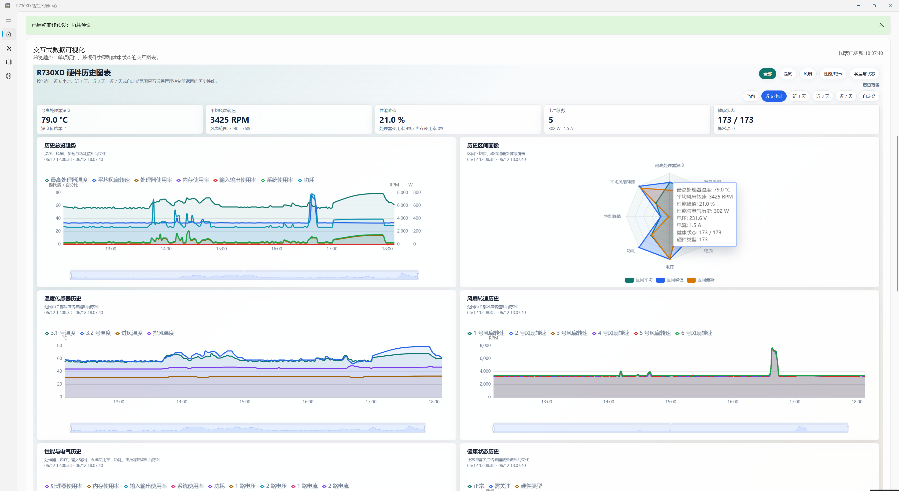
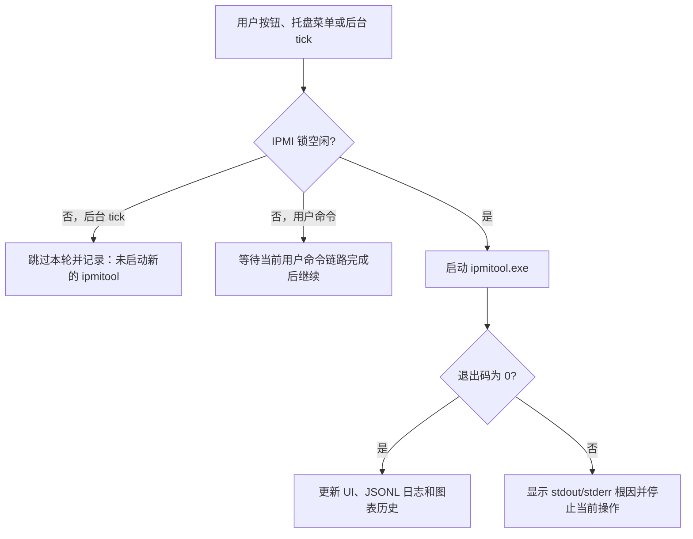
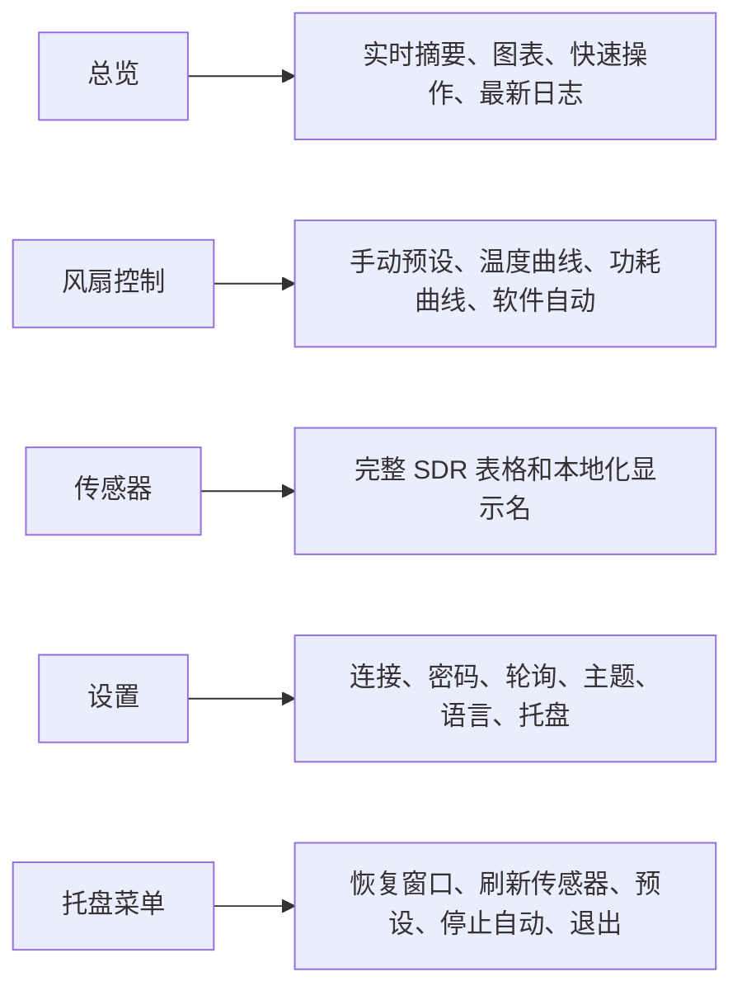
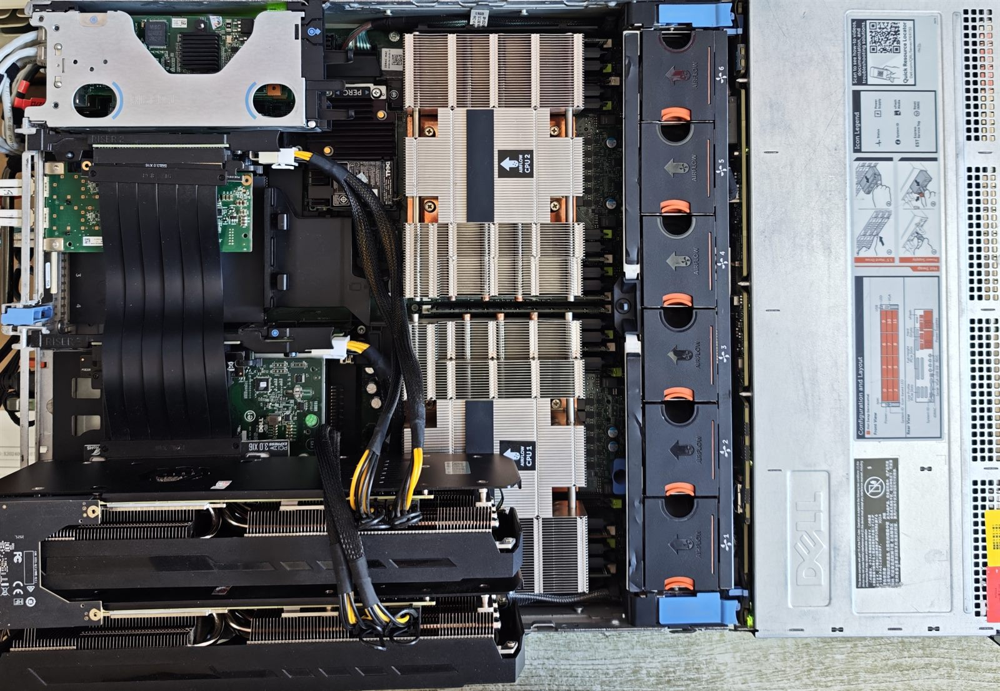
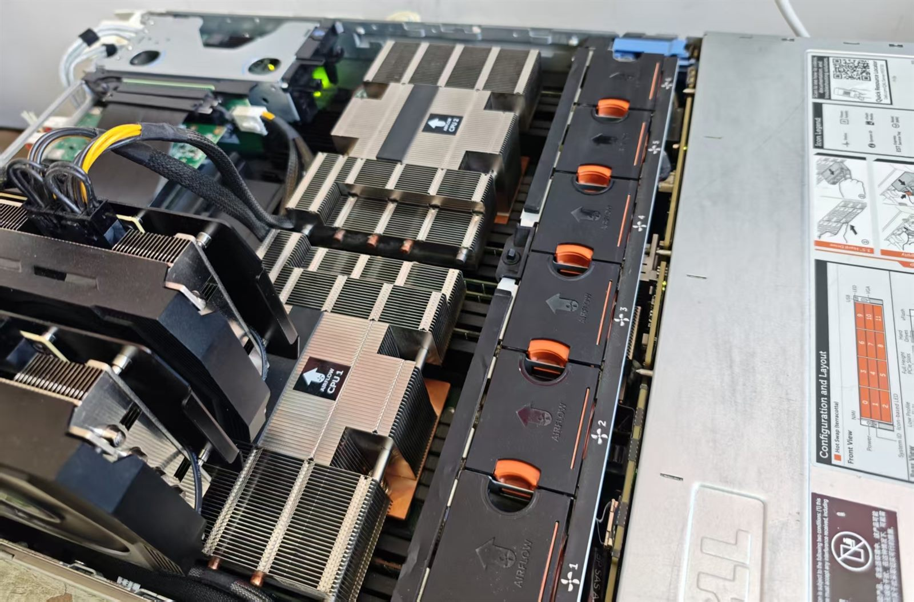

<p align="center">
  
</p>

<h1 align="center">Dell PowerEdge R730xd Fan Control Center / R730XD 风扇控制中心</h1>

<p align="center">
  <strong>Windows 图形化 Dell PowerEdge R730xd 风扇控制工具：通过 iDRAC/IPMI 与 ipmitool 调速，监控 BMC SDR 传感器，并运行温度或功耗风扇曲线。</strong>
</p>

<p align="center">
  <a href="README.en-US.md">English</a> |
  <a href="README.md">简体中文</a> |
  <a href="README.zht.md">繁體中文</a> |
  <a href="README.ko.md">한국어</a> |
  <a href="README.de.md">Deutsch</a> |
  <a href="README.es.md">Español</a> |
  <a href="README.fr.md">Français</a> |
  <a href="README.it.md">Italiano</a> |
  <a href="README.da.md">Dansk</a> |
  <a href="README.ja.md">日本語</a> |
  <a href="README.pl.md">Polski</a> |
  <a href="README.ru.md">Русский</a> |
  <a href="README.bs.md">Bosanski</a> |
  <a href="README.ar.md">العربية</a> |
  <a href="README.no.md">Norsk</a> |
  <a href="README.br.md">Português (Brasil)</a> |
  <a href="README.th.md">ไทย</a> |
  <a href="README.tr.md">Türkçe</a> |
  <a href="README.uk.md">Українська</a> |
  <a href="README.bn.md">বাংলা</a> |
  <a href="README.gr.md">Ελληνικά</a> |
  <a href="README.vi.md">Tiếng Việt</a>
</p>

<p align="center">
  <a href="docs/COMMANDS.md">IPMI 命令参考</a> ·
  <a href="SECURITY.md">安全说明</a> ·
  <a href="docs/PROJECT_METADATA.md">项目元数据</a>
</p>

<p align="center">
  
  
  
  
  
  <a href="https://github.com/mason369/dell-poweredge-r730xd-fan-control/releases/latest"></a>
  
  
</p>

Dell PowerEdge R730xd Fan Control Center 是一款 Windows WinUI 3 桌面应用，用于通过 iDRAC/IPMI over LAN 管理 Dell 服务器风扇。它把 `ipmitool raw 0x30 0x30` 手动调速、Dell 自动模式、CPU 温度自动调速、温度/功耗风扇曲线、BMC SDR 传感器监控、Fan RPM 看板和本地历史图表放进同一个界面，适合 homelab、机房值守，以及第三方硬盘或 PCIe 设备导致 R730xd 风扇长期高转的场景。

应用只面向当前代码和文档明确覆盖的 R730xd/iDRAC 场景，不是通用服务器管理平台，也不承诺兼容所有 Dell PowerEdge 型号或固件。认证、权限、网络、日志写入、WebView2、SDR 解析或 Dell OEM raw 命令失败时，界面和 JSONL 日志会显示真实原因，不会自动换后端、把失败标成成功或用旧读数补图。

> [!WARNING]
> 风扇 raw 命令会直接改变服务器散热能力。当前硬件观察环境仅为 Dell PowerEdge R730xd / iDRAC 2.82；低转速、自动曲线和单风扇目标编号必须在有人值守时验证。单风扇控制默认关闭，本机观察到目标编号 `0x00` 会让全部风扇高转，而不是单独控制 Fan 1。

## 核心能力

| 能力 | 当前行为 |
| --- | --- |
| 手动与固件控制 | 设置全部风扇 `0-100%`，保存手动预设，或用 Dell 自动模式把控制权交回 iDRAC/BMC。 |
| 自动风扇控制 | 按 CPU 温度运行软件恒温策略，或使用可编辑的温度-风扇、功耗-风扇曲线；首轮真实 SDR 与风扇命令成功后才标记为运行中。 |
| BMC 硬件监控 | 执行真实 `mc info` 与 `sdr elist`，显示温度、Fan 1-6 RPM、功耗、电压、电流、冗余和离散状态。 |
| 历史与可视化 | 使用本地 ECharts/WebView2 图表记录成功 SDR 刷新的最近 7 天历史；损坏 JSONL 会保留备份并显式报告。 |
| Windows 值守 | WinUI 3 界面、22 种 UI 语言、托盘菜单、动态预设、主题和开机后运行状态恢复。 |
| 凭据与审计 | 密码通过 `IPMI_PASSWORD` 环境变量传给 `ipmitool -E`，可选用当前 Windows 用户的 DPAPI 保存；命令、耗时和失败写入本地 JSONL。 |

## 下载与项目状态

| 项目 | 当前状态 |
| --- | --- |
| Windows 下载 | [GitHub Releases 最新版](https://github.com/mason369/dell-poweredge-r730xd-fan-control/releases/latest)。下载 `DellR730xdFanControlCenter-win-x64.zip`，完整解压后运行 `DellR730xdFanControlCenter.exe`。 |
| 当前源码版本 | 应用版本 `1.1.2`；程序集、文件和 MSIX Identity 版本 `1.1.2.0`。打包版本以对应 Release 标签和 exe 文件版本为准。 |
| 当前 GitHub Release | 已发布版本仍为 `v1.1.0`，发布 zip 内的 exe/dll 文件版本为 `1.1.0.0`；`1.1.2` 源码需由对应已提交标签触发 GitHub Actions 后才成为正式 Release。不能只改 Release 标题或复用旧二进制文件。 |
| 发布格式 | 主要下载物是 unsigned unpackaged 自包含 zip，不需要安装 MSIX；Windows 可能因为未签名显示安全提示。 |
| 本地打包 | `tools/Publish-ReleaseZip.ps1` 先清理专用 `artifacts/release` 输出目录，再生成 `DellR730xdFanControlCenter-win-x64.zip`，并校验运行时、许可证、图表、ipmitool 和禁止混入的包身份/WebView2 文件。ZIP、校验目录和 signed-MSIX 输出必须解析到仓库目录内；越界路径会在创建或递归清理前失败停止。 |
| 目标硬件 | Dell PowerEdge R730xd。本机仅在 R730xd / iDRAC 2.82 上观察过 SDR 耗时和部分 raw 行为，其他固件必须人工验证。 |
| 本地数据 | 设置、日志、图表历史和 WebView2 数据写入 `%LocalAppData%\DellR730xdFanControlCenter`。 |
| 验证入口 | `Tests/PresetModelTests`、x64 Release 构建、发布 zip 校验，以及目标 R730xd/iDRAC 的有人值守验证。 |

## 快速入口

| 目标 | 入口 |
| --- | --- |
| 下载 Windows 版或核对源码版本 | [下载与项目状态](#下载与项目状态) |
| 立即了解能做什么 | [功能总览](#功能总览) |
| 首次连接 iDRAC | [首次使用流程](#首次使用流程) |
| 构建或本机运行 | [构建](#构建) / [运行](#运行) |
| 跑测试、打包和发布校验 | [验证](#验证) / [发布](#发布) |
| 核对 raw 命令和风扇目标编号 | [IPMI 命令参考](docs/COMMANDS.md) |
| 查看凭据、日志和供应链风险 | [安全说明](SECURITY.md) |
| 查看面向维护者的项目摘要 | [项目元数据](docs/PROJECT_METADATA.md) |
| 查看开源许可证和第三方声明 | [许可证](#许可证) / [第三方声明](THIRD_PARTY_NOTICES.md) |
| 排查传感器、轮询、图表或托盘问题 | [故障排查](#故障排查) |
| 参与维护或提交问题 | [维护与贡献](#维护与贡献) |

## 5 分钟快速使用

这部分适合已知 iDRAC 地址、用户名和密码，并希望先完成传感器与风扇控制基础验证的用户。

1. 在 iDRAC 中启用 **IPMI over LAN**，并确认当前 Windows 主机能访问 iDRAC 管理网络。
2. 从 [GitHub Releases](https://github.com/mason369/dell-poweredge-r730xd-fan-control/releases/latest) 下载 `DellR730xdFanControlCenter-win-x64.zip`，完整解压后运行 exe。开发者也可以从源码启动：

   ```powershell
   cd C:\DellR730xdFanControlCenter
   dotnet run --project .\DellR730xdFanControlCenter.csproj -c Debug -p:Platform=x64
   ```

3. 首次打开会进入“设置”页。填写 iDRAC/BMC 地址、用户名和密码；如需下次自动连接，打开“使用 Windows 数据保护保存密码”。
4. 点击“保存设置”。应用会执行真实 `mc info` 连接测试，再执行一次 `sdr elist`，成功后开始持续轮询。
5. 回到“总览”页，确认 CPU/进风/排风温度、Fan 1-6 RPM、功耗、电压、电流和状态卡片都有真实读数。
6. 先使用“还原戴尔出厂设置转速”或 20%/35% 这类保守值确认机器行为；低转速、单风扇目标编号和曲线自动策略都应在有人值守时逐步验证。
7. 需要把控制权交回 BMC 时，点击“还原戴尔出厂设置转速”。该操作会在等待 IPMI 锁前停止软件自动或曲线自动，再发送 Dell 自动模式命令；不需要随后再点“停止自动”。


## 软件运行界面

下图是实际运行中的软件界面截图，展示交互式数据可视化、历史范围筛选、温度/风扇/性能与电气图表，以及顶部状态回显。截图里的数值来自本机 R730xd 验证环境，只作为界面与数据流示例；不同负载、iDRAC 固件、风扇墙、硬盘数量和环境温度会产生不同读数。



## 图解工作流

### 命令与失败处理



### 页面与常用入口



## 多语言文档和界面

- README 语言入口： [English](README.en-US.md)、[简体中文](README.md)、[繁體中文](README.zht.md)、[한국어](README.ko.md)、[Deutsch](README.de.md)、[Español](README.es.md)、[Français](README.fr.md)、[Italiano](README.it.md)、[Dansk](README.da.md)、[日本語](README.ja.md)、[Polski](README.pl.md)、[Русский](README.ru.md)、[Bosanski](README.bs.md)、[العربية](README.ar.md)、[Norsk](README.no.md)、[Português (Brasil)](README.br.md)、[ไทย](README.th.md)、[Türkçe](README.tr.md)、[Українська](README.uk.md)、[বাংলা](README.bn.md)、[Ελληνικά](README.gr.md)、[Tiếng Việt](README.vi.md)。
- 兼容入口：[README.zh.md](README.zh.md) 会跳转说明到默认简体中文 README。完整长版维护文档目前以当前文件 [README.md](README.md) 和 [README.en-US.md](README.en-US.md) 为准；其他语言 README 提供对应语言的核心使用、安全和验证入口，避免没有真实目标文件的语言切换。
- 中文配套文档：[IPMI 命令参考](docs/COMMANDS.md)、[安全说明](SECURITY.md)、[项目元数据](docs/PROJECT_METADATA.md)。
- English companion docs: [IPMI Command Reference](docs/COMMANDS.en-US.md), [Security](SECURITY.en-US.md), [Project Metadata](docs/PROJECT_METADATA.en-US.md).
- 应用界面内置 22 种语言。进入“设置”页，在“界面语言”下拉框选择语言并保存；可见 UI 会立即切换，已写入的 JSONL 运行日志保持结构化字段和原始运行语义，不会被重写成另一种语言。

## 适用范围

- 目标机器：Dell PowerEdge R730xd。
- 目标控制面：iDRAC/BMC 的 IPMI over LAN。
- 目标系统：Windows 10 2004 / build 19041 或更新版本。
- 目标用户：需要在 homelab、机房值守、硬盘密集型 R730xd 或噪音受限环境中监控和调节风扇的用户。
- 已本机观察环境：R730xd / iDRAC firmware 2.82。文档和默认配置使用保留示例地址 `192.0.2.10` 与示例用户 `idrac-user`；真实内网地址和账号不应提交到仓库。

不同 iDRAC 固件、不同背板和不同风扇/传感器布局可能改变单风扇目标编号行为。当前代码已实现 Fan 1-6 目标编号控制但默认关闭；`0x00` 是固件 raw 命令中的目标编号，不是 `0%` 转速，必须先确认固件映射再启用。

### 使用范围照片

下列照片展示本项目实际面向的 Dell PowerEdge R730xd 机箱内部使用环境，包括双 CPU 散热器、前置风扇墙、扩展卡区域和机箱风道。照片用于说明本软件的硬件适用范围；它不代表每台 R730xd 的背板、扩展卡、硬盘数量、线缆布置或 iDRAC SDR 传感器命名都完全相同。





## 功能总览

- 现代 WinUI 3 界面，支持浅色、深色、跟随系统主题。
- 全部风扇 0-100% 百分比控制，设置前会切入手动风扇模式。
- 手动模式切换成功后，如果紧接着的全部/单风扇百分比 raw 命令失败，应用会发送一次 Dell 自动恢复命令，降低 BMC 停留在手动模式并保持旧转速的风险。失败的百分比命令不会重试；恢复成功时原请求仍显示失败，但界面和 LastRunning 改为 Dell 自动。恢复也失败时会同时保留两次异常，并明确提示硬件模式无法确认。
- 内置“默认/恢复手动”预设保留手动模式 + 全部风扇 10%，用于用户明确选择该预设时回到本机安静基线。
- 初始预设：默认 10%、均衡 20%、散热 35%、性能 50%、Dell 自动。
- 支持编辑预设名称、说明和可用百分比，支持添加、保存、删除手动百分比预设；初始预设也可以删除，删除后会写入 `settings.json`，下次启动不会自动补回，只有移除或重建设置文件才会重新生成初始预设。
- 支持添加和编辑温度-风扇曲线预设，也支持功耗-风扇曲线预设；两种编辑器都可点击空白处添加点位、拖动实时调整或用右侧数字控件精调。1.0.15 的图表提供刻度、面积层和固定在图外的悬停读数栏，辅助线不会遮住或拦截鼠标；平滑模式使用无过冲的单调三次插值，切换后按轮询周期持续控制全部风扇。
- Dell 自动风扇模式保留为独立操作和预设入口，会在等待 IPMI 锁前停止正在运行的软件自动策略，再发送命令把控制权交还给 iDRAC/BMC；成功后会清空曲线/软件自动状态，并把 Dell 自动写为当前运行预设。
- 1-6 号风扇单独目标字节控制已实现，但默认关闭。
- 软件自动策略会读取 BMC SDR。全局策略和温度曲线使用 CPU 温度；功耗曲线使用单位为 `Watts` 或名称包含 `Pwr Consumption` 的功耗传感器，但仍会先检查 CPU 紧急温度阈值。
- 达到紧急温度阈值时，软件恒温策略会发送 Dell 自动模式命令；命令成功后会停止软件自动计时器、清空曲线/软件自动状态、把 Dell 自动写为当前运行模式，并显示警告。
- 点击“开始轮询”或保存设置成功后会测试 iDRAC 连接、刷新一次 SDR，并在 `SensorPollingStarted` 记录真实刷盘后才启动持续 SDR 轮询和显示“已连接并开始轮询”。如果该记录无法写入，计时器不会启动，界面会显示日志写入根因。轮询中同一按钮显示为“取消轮询”，点击后停止后续传感器轮询 tick，并同时停止等待中的后台重连重试。默认间隔为 1 秒；同一时刻只允许一个 IPMI 操作，上一轮未完成时会跳过本次 tick，且不会启动新的 `ipmitool` 进程或 RMCP+ 会话。后台传感器轮询命令失败时，应用会先停止当前轮询、显示并记录原始失败，然后按当前轮询间隔持续执行真实重连流程（`mc info` + `sdr elist`）；重连成功才恢复轮询，重连失败会继续显示根因并等待下一次重连，不会写入无真实 SDR 来源的图表历史点。若某次 `Unable to establish IPMI v2 / RMCP+ session` 等瞬时失败后，后续真实 `sdr elist` 已经成功刷新传感器，顶部旧错误条会关闭，失败事件仍保留在 JSONL 运行日志中。
- 手动预设、Dell 自动、温度曲线、功耗曲线或软件恒温策略成功启动后，运行状态会写入 `%LocalAppData%\DellR730xdFanControlCenter\settings.json`；下次打开软件并成功连接/开始轮询后，会按保存的状态重新执行真实预设或自动策略。恢复失败会显示真实错误，不会只把界面标成正在运行。软件恒温或曲线自动只有在首轮真实 tick 成功后才会把横幅、模式卡片和活动预设标为自动运行。启动失败和停止自动会清空这些自动模式状态；紧急 Dell 自动会把 Dell 自动保存为运行模式。若进入手动模式成功、百分比 raw 命令失败，且随后一次 Dell 自动安全恢复成功，原 tick 仍按失败显示，软件自动计时器停止，界面和 LastRunning 改为 Dell 自动而不是手动；如果安全恢复也失败，软件自动仍停止，并明确提示硬件模式无法确认。已经运行的自动计时器若在计算目标前读取 SDR 失败，或正常 raw 风扇命令已经成功、但紧随其后的确认刷新 `sdr elist` 失败，会显示并记录本轮失败，同时保留所选自动策略和 LastRunning 状态，下一次计划 tick 会再次执行真实 SDR 读取。首轮启动遇到同类失败仍不会启动计时器；紧急 Dell 自动后的确认刷新失败也不会保留软件自动状态。
- 用户主动执行的风扇命令会等待当前 IPMI 命令完成后继续执行，不会在切换预设时弹出“已有命令正在执行”的错误；后台轮询 tick、软件自动 tick 和曲线自动 tick 仍然在 IPMI 忙时跳过，避免命令堆积。
- 软件自动或曲线自动策略运行时，普通传感器轮询计时器不会再独立发起第二条 `sdr elist` 采样链路；每次自动策略 tick 自己读取 SDR、更新传感器列表、看板、交互图表和 JSONL 图表历史。停止自动策略后，普通轮询按原设置继续触发。
- 软件自动和曲线自动会记住同一自动模式下最近一次成功下发的全部风扇百分比；后续 tick 如果根据当前温度或功耗仍计算出同一百分比，只记录“未下发风扇命令”并刷新传感器/图表，不再重复发送相同的 Dell raw 风扇控制命令。切换自动模式、恢复上次运行的自动策略、手动调速、单风扇调速、Dell 自动或停止自动会清除此缓存；新的自动策略首轮 tick 会真实下发一次计算出的目标百分比，即使它和内存里最近记录的百分比相同，避免软件重启、托盘后台运行或外部 iDRAC 操作后把 BMC 的真实状态误判为已经生效。
- 所有实际 `ipmitool` 命令，包括 Dell 风扇控制 raw 命令（`raw 0x30 0x30 ...`），非零退出码都会立即失败并显示 stdout/stderr；应用不会把失败的 raw 风扇命令标成成功，也不会自动重复下发同一条失败命令。唯一的风扇安全收口是：进入手动模式已成功、随后百分比命令失败时，发送一次不同的 Dell 自动恢复命令。后台持续恢复只用于传感器轮询失败：应用会执行可见的真实重连（`mc info` + `sdr elist`），直到轮询恢复或用户取消轮询；这些重连不会重新应用上次保存的风扇预设或自动策略。
- 用户触发的风扇命令成功后，包括全部风扇、单风扇、手动预设、恢复手动预设和 Dell 自动模式，应用会立即再执行一次 `sdr elist`，用真实 BMC 返回刷新风扇 RPM 看板、功耗与状态、交互图表和 JSONL 图表历史点；刷新失败会显示真实错误，不会把刚下发的百分比当作传感器读数。刷新成功后会把下一轮定时器从刷新完成时重新开始计算，避免刚刷新完又被原定时 tick 重复触发。
- 内置 `ipmitool.exe` 与所需 Cygwin DLL，路径为 `BundledTools/ipmitool`。启动时应用会把进程当前目录规范化到应用目录，并且运行时通过应用目录解析内置工具路径；即使从 Windows 开始菜单快捷方式启动、快捷方式工作目录落在 `%AppData%\Microsoft\Windows\Start Menu\Programs`，也不会用开始菜单目录查找 `BundledTools`。
- 启动时会先获取当前 Windows 会话的单实例互斥锁，再扫描同名但文件版本不同的旧版或新版进程；这样同时启动两个相同版本时只有互斥锁失败的一方退出，不会出现两个新进程互相判定后同时退出。检测到旧版、新版或第二个同版本窗口仍在运行时，新启动会写入 `%LocalAppData%\DellR730xdFanControlCenter\startup-error.log`，弹窗说明已有实例或进程 ID，并以退出码 `2` 停止本次启动；这样可以避免多个实例同时写入 `settings.json` 或并发发送 IPMI 风扇命令。需要切换版本或验证新包时，请先退出旧窗口和托盘实例，再从开始菜单或发布目录启动。
- 内置本地 ECharts 仪表板资产，路径为 `Assets/Charts/dashboard.html` 与 `Assets/Charts/echarts.min.js`，运行时不依赖在线 CDN。
- 总览交互图表会在每次成功 SDR 轮询后保存完整图表快照，并持久化到 `%LocalAppData%\DellR730xdFanControlCenter\chart-history\chart-history-YYYYMMDD.jsonl`。图表顶部“历史范围”可切换“当前、近 6 小时、近 1 天、近 3 天、近 7 天、自定义”，默认按最近 7 天保留历史文件；应用重启后会重新加载仍在保留期内的历史点。如果历史 JSONL 中出现损坏行（例如异常关机留下的 `0x00` 内容或半行 JSON），启动加载会显示真实失败、把原文件保存在同目录的 `*.corrupt-*.bak`，并用仍可解析的有效行重写活动 `chart-history-YYYYMMDD.jsonl`，避免每次启动重复卡在同一坏行。
- 托盘图标支持最小化后台运行；右键菜单把页面入口、刷新传感器、打开 iDRAC、打开日志、停止自动策略、还原戴尔出厂设置转速、全部风扇 20/35/50% 和预设切换组织在同一层级，动态预设只保留一层子菜单。托盘还原会发送 Dell 自动模式命令，不会改成手动 10%。托盘设置加载、菜单构建、同步动作或异步命令抛出的异常会进入主页面失败栏并写日志；DispatcherQueue 已拒绝入队时会明确报错，不会静默丢弃点击。
- iDRAC Web 控制台快捷入口会打开 `https://<host>/`。
- 可见 UI 字符串接入多语言资源，当前内置 22 种界面语言：English、简体中文、繁體中文、한국어、Deutsch、Español、Français、Italiano、Dansk、日本語、Polski、Русский、Bosanski、العربية、Norsk、Português (Brasil)、ไทย、Türkçe、Українська、বাংলা、Ελληνικά、Tiếng Việt。语言切换器按每种语言自己的名称显示选项，不会把所有语言名翻译成当前界面语言；MSIX 包清单的应用显示名和描述也通过 `Strings/<language>/Resources.resw` 本地化，避免开始菜单、安装包元数据或系统壳层显示固定中英文。`Dell`、`PowerEdge`、`R730xd`、`iDRAC`、`IPMI`、`BMC`、`SDR`、`CPU`、`RPM`、`OEM`、`RMCP+`、`ipmitool`、`WebView2`、`ECharts`、`DPAPI`、`JSONL` 等专业标识保持原文，`°C`、`s`、`W`、`V`、`A`、`%` 等单位也不翻译；后台 JSONL 日志和内部运行记录仍保留中文/结构化内部语义，不做 UI 多语言转换。
- 图表、看板和传感器表格的“传感器”列使用本地化显示名；已登记的 SDR 名称会翻译为当前界面语言，未登记的英文或厂商名称保留 BMC 原始 key，不会改写成没有真实来源的通用事件名。原始 key 仍用于内部分类和匹配；需要核对完整原始输出时，请手动运行 `ipmitool sdr elist`。
- 总览交互图表位于 WebView2 中，滚轮事件会在浏览器侧归一化后立即转交外层 WinUI `ScrollViewer`；原生区域和图表区域都进入同一累计目标与 `ChangeView` 动画路径。连续滚轮到来时，新距离从上一动画目标继续累加，不再从尚未完成的中间偏移重新计算，因此不会丢掉前一段距离；图表侧也不再额外等待一帧后才发消息。触控板/高频小幅滚动仍保留像素增量。ECharts 内部滚轮缩放关闭，历史范围仍通过底部滑块调整。
- 主窗口和图表页针对 Windows DPI 缩放、窗口宽度和窄屏布局做自适应；`app.manifest` 声明 `PerMonitorV2`，`MainPage.xaml.cs` 在启动和窗口尺寸变化时按有效像素宽度切换 Small、Medium、Large 布局，图表页面 `Assets/Charts/dashboard.html` 也会读取容器宽度和 `window.devicePixelRatio` 重新排版。该适配不需要在设置页手动开启，失败时不会生成无真实加载结果的图表或布局成功状态。
- 密码可使用 Windows DPAPI 在当前 Windows 用户上下文加密保存。
- 运行日志会以 JSON Lines 写入 `%LocalAppData%\DellR730xdFanControlCenter\logs\runtime-YYYYMMDD.jsonl`，每一行都是完整原子事件，并记录用户命令、传感器刷新、软件恒温 tick 和 IPMI 命令耗时。
- 启动异常会写入 `%LocalAppData%\DellR730xdFanControlCenter\startup-error.log`。

## 界面结构

### 分辨率、DPI 与窗口缩放

主界面在应用启动和每次窗口尺寸变化时自动适配，不需要用户在设置页开启额外开关。

- 入口和范围：适配覆盖总览、历史图表、快速操作、温度看板、风扇看板、功耗与健康看板、风扇控制、曲线编辑器、传感器表格和设置页；托盘菜单仍使用 Windows 原生菜单，由系统按 DPI 渲染。
- 默认配置：`app.manifest` 使用 `PerMonitorV2` DPI 感知，应用按 WinUI 有效像素而不是物理分辨率切换布局。`MainPage.xaml.cs` 当前断点为 `<641` Small、`641-1007` Medium、`>=1008` Large。
- 执行流程：`MainPage.OnPageSizeChanged` 调用 `ApplyResponsiveLayout`，随后重排横幅、总览指标卡、快速操作、全部风扇控制、预设编辑、温度/功耗曲线编辑、软件恒温控制和设置页命令栏。Small 布局会把 `NavigationView` 改为顶部导航；Medium 和 Small 布局会让温度、风扇和功耗/健康看板改用页面滚动，不再用固定高度截断内容。
- 图表流程：总览 WebView 的最小高度在 Large 布局为 `1520`，Medium/Small 为 `3200`，避免历史图表区域被后续内容遮住；`Assets/Charts/dashboard.html` 根据容器宽度、图表数量和 `window.devicePixelRatio` 调整网格、图例、坐标轴边距和曲线显示。图表标签不使用省略号作为正常显示策略。
- 成功行为：在窄窗口或高 DPI 下，卡片、命令栏、图表和表格应通过换行、重排或外层滚动显示完整内容；不应出现底部横线穿过内容、图表被遮住、按钮文字挤在一起、性能/电气标签省略或页面横向溢出。
- 失败行为：如果 WebView2 资源、图表脚本或本地资产加载失败，顶部错误和运行日志会显示真实失败；应用不会用空白图片、无来源数据或静默降级把图表显示为可用。
- 已验证范围：当前仓库的静态检查包含 `Tests/PresetModelTests/Program.cs` 中的 `RunContentScrollWidthXamlChecks`、`RunDpiTextWrappingXamlChecks` 和 `RunDashboardChartLayoutChecks`。本机人工验证覆盖 Windows 窗口 `640x900`、`920x900`、`1366x900`，以及图表页等效 DPR `1.0`、`1.25`、`1.5`、`1.75`、`2.0`。该验证记录不等同于承诺所有远程桌面、显卡驱动缩放或第三方窗口管理器组合都无差异；遇到异常时请记录 Windows 缩放百分比、窗口大小、截图和运行日志。

### 总览

总览页用于观察当前硬件状态和执行最常用操作：

- 横幅实时摘要显示当前温度、平均风扇转速、实时功耗、平均电压和总电流，数据来自最近一次成功 SDR 传感器刷新；每个大数值下方会按行显示该类别的全部具体传感器小项，例如所有进风/排风/CPU 温度、Fan 1-6 RPM、电源功耗、所有电压轨和所有电流轨，不再截断成前三项。实时摘要卡片有更高的基础高度，并会随实际传感器数量继续自动增高；如果某个 BMC 返回更多风扇或更多电气轨，界面会按实际返回数量显示。首次刷新前或缺少某类传感器读数时显示“等待刷新”。温度摘要使用最新温度传感器读数的平均值，不使用历史最高值；概览卡和紧急自动保护仍保留独立的最高/CPU 温度口径。大数值和明细会按推荐区间实时着色：正常绿色、接近风险黄色、偏离明显橙色、危险红色；当前阈值为温度 `<60/60-69/70-79/>=80 °C`，平均转速 `2500-6000` 绿、`1500-2499 或 6001-9000` 黄、`500-1499 或 >9000` 橙、`<500` 红，功耗 `<500/500-699/700-899/>=900 W`，电压 `210-240` 绿、`200-209 或 241-250` 黄、`190-199 或 251-260` 橙、其他红，总电流 `<4/4-5.9/6-7.9/>=8 A`。颜色只是界面提示，不替代完整传感器表、iDRAC 告警或紧急自动保护。
- 横幅左侧在标题下方显示“当前温控模式”徽章，直接标明正在运行的是待机、手动控制、Dell 自动温控、软件恒温策略、温度曲线自动或功耗曲线自动；切换预设、启动/停止自动策略和自动 tick 更新百分比时会与右侧状态卡同步更新。
- 横幅右侧状态卡显示当前 iDRAC 目标、连接状态、当前控制模式、最近请求状态和最后更新时间。
- 最近请求状态会在点击“切换”、连接/刷新传感器、保存设置、启动/停止软件自动、曲线自动 tick、轮询成功/跳过/失败时实时更新；横幅里显示“请求中、正常、已跳过、失败、已调速”等短状态，完整原因仍显示在顶部 InfoBar 和运行日志中。
- 指标卡展示最高 CPU 温度、风扇状态、实时功耗、平均电压、总电流和当前控制模式；功耗、电压、电流同样来自最近一次成功 SDR 刷新，缺少读数时显示等待或无读数。
- 交互式数据可视化改为面向历史范围查看：总体趋势图同时显示最高温度、平均风扇转速、处理器/内存/输入输出/系统使用率和功耗；区间画像图对比区间平均、区间峰值和区间最新；温度图显示范围内全部有效温度传感器时间序列；风扇图显示范围内全部有效风扇转速时间序列；性能与电气图显示有效的处理器、内存、输入输出、系统使用率、功耗、电压和电流时间序列；健康状态图显示正常与需关注传感器数量随时间变化。每次成功轮询会保存经过有效性筛选的摘要、当前读数、类型统计和传感器树，并写入带 `timestamp` 与 `unixMilliseconds` 的 JSONL 历史点；如果某轮 SDR 读取失败、被跳过或没有新 SDR 数据，不会写入无真实 SDR 来源的历史点。历史加载或写入失败会显示顶部错误并写入运行日志。
- 温度大看板逐项展示 BMC SDR 中每一个温度传感器，卡片带温度图标并按当前读数显示推荐状态色。卡片副标题会把 SDR 元信息显示为“编号 0x30 / 位置 7.1”这类紧凑标签；其中原始 `30h` 会转换成更不易误读为小时的 `0x30` 记录编号，`7.1` 是 IPMI 实体/实例位置。
- 风扇 RPM 看板展示 Fan 传感器当前转速，卡片带风扇图标；风扇图标会持续旋转，并根据 RPM 调整旋转周期，转速越高动画越快，0 或缺失读数不会显示成高速正常状态。风扇卡片同样显示“编号 0x30 / 位置 7.1”式副标题，避免只看到裸 `30h · 7.1`。
- 功耗与状态看板展示最近一次真实 `sdr elist` 中全部有效的非温度、非风扇项目，包括 CPU / MEM / IO / SYS 使用率、功耗、电压、电流、冗余、电池、硬盘在位、RAID/PERC、缓存、入侵和 Power Optimized；其中 `Power Optimized` 在界面显示为“电源优化策略”。硬盘、RAID 控制器和缓存有独立图标，但只有 BMC 当前确实返回有效行时才显示；不会合成 BBU 容量、缓存命中率、RAID 性能等不存在的数值。看板不限制卡片数量，长文本会换行并保留“编号/位置”元信息。
- 温度、风扇、功耗与状态看板以及传感器明细表都关闭内部纵向滚动条，由页面最外层 WinUI `ScrollViewer` 统一滚动。图表 WebView 和原生区域的鼠标滚轮都进入同一套归一化距离、累计目标和 `ChangeView` 动画路径；ECharts 仍用底部滑块调整历史范围，不占用页面滚轮。

- 快速操作包含刷新传感器、还原戴尔出厂设置转速、打开 iDRAC 和全部风扇百分比设置；软件恒温策略的启动/停止入口位于“风扇控制”页。
- 最新日志展示最近命令、成功/失败状态和轮询提示，并提供“打开日志文件夹”入口。界面状态标记按级别着色：信息为蓝色、警告为琥珀色、成功为绿色，只有错误和失败使用红色；本地 JSONL 运行日志仍写入纯文本结构化字段，不写入颜色值。

#### 图标与动态语义（1.0.14）

- 入口是总览页的温度看板、风扇 RPM 看板以及功耗与状态看板。传感器会映射到温度、CPU / MEM / IO / SYS 使用率、功耗、电压、电流、入侵、风扇/电源冗余、CMOS / ROMB / BBU 电池、硬盘、RAID/PERC 控制器、缓存、USB 过流、电源策略或通用状态图标。未识别但状态为 `ok` 的真实传感器使用绿色通用正常图标；明确的 warning 或 critical 仍优先。`ns`、`na`、`No Reading`、`Disabled`、`Not Available`、`N/A`、`Unknown` 和非有限数值不会进入看板、明细表或图表；带真实 warning/critical 状态码的离散告警即使没有数值也保留。每张卡片还有非颜色 badge，区分 normal、information、inactive、unavailable、warning、critical 和 stale；读屏名称同时包含数值、状态和断开信息。
- 看板风扇保留四叶十字形并围绕中心旋转；导航栏改为静态的圆形风扇外框和四片弯曲叶片，不再呈对角 X 形，也不把导航图标当作 RPM 指示。0 RPM 停止；正 RPM 只使用最近一次成功 `sdr elist` 的真实读数，按 RPM 线性换算每秒转数，低转速端的单圈周期上限为 `5.2 s`，18000 RPM 及以上为 `0.11 s`，因此 3600 RPM 会比 3480 RPM 稍快。读数变化时只调整播放速率，不重置当前角度。
- 温度和 CPU / MEM / IO / SYS level、已知 `Voltage N` 电压指针只在真实新样本改变时做一次过渡；电压表盘的已知范围是 `190..260 V`。只能根据 `Volts` / `Amps` / `Watts` 单位回退识别的厂商传感器仍保留对应图标，但显示 Information 和静态中性样式；适用电压表盘时，指针位于中位。这类传感器不套用 230 V 或电流/功耗阈值。非有限数值、`No Reading` 和 `Unknown` 明确显示 Unavailable。
- 正电流显示轻微流动，正功耗显示轻微活动；正常 health 状态保持静态，只有 warning / critical 显示状态脉冲。所有动画只表示最近成功 SDR 的展示状态，不在两次轮询之间插值或生成读数。轮询停止、连接断开、数据 stale、0 RPM、disabled 或无读数时会停止运动，并用时钟/状态形状保留静态语义。Windows 关闭动画、启用高对比度或窗口隐藏到托盘时也停止动画；恢复可见且允许动画后再继续。高对比度使用系统前景色和完整不透明度。
- 分类先匹配精确的原始 SDR key，再按单位和真实名称模式回退；异常状态码优先于数值样式，未知范围不猜测。未知但有效的厂商 key 保留 BMC 原名，不替换成虚构的“硬件事件”名称。Dispatcher 回调或 Composition 更新失败会通过 `VisualUpdateFailed` 交给主页面 `ShowFailure`，打开错误栏并写运行日志，不会把卡片标成动画成功；若控件没有错误处理器，则显式抛出异常，未处理时写入 `%LocalAppData%\DellR730xdFanControlCenter\startup-error.log`，进程可能终止。该功能位于 `Models/SensorReadingAvailability.cs`、`Models/DashboardSensorPresentation.cs`、`Models/DashboardSnapshotFreshness.cs`、`Controls/DashboardSensorIcon.xaml(.cs)` 和 `MainPage.xaml`；筛选只用于展示副本，不修改自动调速使用的原始 SDR 集合，也不修改 IPMI 命令、raw 风扇控制、轮询、自动策略或设置。
- 可用 `dotnet run --project .\Tests\PresetModelTests\PresetModelTests.csproj -c Release` 检查分类、状态、动画边界和源码约束，再用 `dotnet build .\DellR730xdFanControlCenter.csproj -c Release -p:Platform=x64` 验证 x64 Release 构建。测试程序不读取 README、`SECURITY` 或 `docs` 正文，成对文档仍需单独核对。动画不是控制回路或安全告警；传感器最终状态以完整传感器表和 iDRAC 告警为准。BMC/固件命名差异可能让传感器落入 unit-only 或 generic，实际更新速度受完整 `sdr elist` 耗时影响。本机检查不代表所有 iDRAC 固件、Windows 显示缩放或高 DPI 组合都已完成人工验证。

### 风扇控制

风扇控制页用于管理预设和高级控制：

- 预设模式区显示当前运行模式、初始预设、自定义预设和每个预设的可编辑说明。
- 手动预设会发送 Dell OEM raw 命令设置全部风扇百分比。
- 默认/恢复类预设和手动预设的百分比可以编辑；总览快速还原和托盘还原现在恢复戴尔出厂设置转速，也就是发送 Dell 自动模式命令，不再执行手动 10%。
- Dell 自动预设会先停止正在运行的软件自动策略，再等待 IPMI 锁并发送命令恢复 BMC 固件自动风扇策略；成功后会清空曲线/软件自动运行态，并把 Dell 自动写为当前运行预设。
- 软件恒温策略的启动/停止卡片位于风扇控制页；目标温度、高温阈值和紧急自动阈值不再提供界面编辑入口，策略继续使用设置文件中的已保存值或代码默认值。轮询秒数在设置页“应用设置”区域保存，启动后每次 tick 都会写入运行日志并更新横幅请求状态。
- 添加手动预设时必须填写名称，百分比会按 0-100 校验。
- 曲线预设通过图形编辑器维护，不需要手写多行文本：温度曲线编辑器维护 `TemperatureCelsius` + `FanPercent`，功耗曲线编辑器维护 `PowerWatts` + `FanPercent`。填写名称后，可点击图表空白处新增点位；拖动会实时更新点位和右侧数字控件。图表使用完整坐标刻度、半透明面积层和 120 点连续预览采样；鼠标移入时，画布只显示不可命中的十字线与圆点，当前温度/功耗和曲线计算百分比显示在图表下方固定读数栏，不会盖住正在操作的位置。标题下的操作说明和右侧 ASCII 预览已移除；读数栏在未悬停时显示点数与输入/输出范围，点位无效时显示真实校验原因。点击已有曲线预设卡片里的“编辑点位”会载入对应编辑器并滚到图表，保存成功后滚回刚新增或更新的预设卡片。
- 温度曲线默认编辑点为 `45 °C = 18%`、`68 °C = 28%`、`78 °C = 42%`；功耗曲线默认编辑点为 `280 W = 18%`、`500 W = 28%`、`750 W = 42%`。这些默认值只用于新建编辑器，不会覆盖已保存预设。
- 曲线点保存时至少需要 2 个点。温度曲线要求温度 `-40` 到 `125` °C、风扇百分比 `0` 到 `100`、温度不重复；功耗曲线要求功耗 `0` 到 `1200` W、风扇百分比 `0` 到 `100`、功耗点不重复。无效点位会在固定读数栏显示失败原因，点击添加或保存时仍按同一套规则严格校验，不会自动改成默认曲线。
- “平滑曲线”开关会保存到预设中。关闭时使用分段线性插值；开启时使用单调三次 Hermite 插值，并按 Fritsch-Carlson 约束计算相邻切线。平滑结果精确经过控制点，不会超过相邻端点的风扇百分比范围；平坦区间保持平坦，只有两个点时退化为线性插值。图表预览和自动策略调用同一算法，最终 raw 命令仍按现有规则四舍五入并钳制到 `0-100%`。第一个点之前和最后一个点之后仍使用端点百分比，紧急 Dell 自动保护不变。
- 切换温度曲线预设会启动软件自动轮询；每次 tick 读取 SDR、解析 CPU 温度、按曲线点位和当前平滑设置计算百分比，只有计算结果与同一自动模式下上次成功下发的百分比不同时才发送全部风扇百分比命令。切换功耗曲线预设时，每次 tick 会读取 SDR、先检查 CPU 紧急温度，再用功耗读数计算百分比；如果本轮找不到功耗传感器，界面和日志会显示真实失败原因，并且不会下发风扇命令。
- 手动全部风扇、单风扇、内置恢复手动预设、Dell 自动、总览/托盘还原戴尔出厂设置转速，以及停止自动都会清除当前曲线状态。用户主动的手动和 Dell 自动命令会在等待 IPMI 锁前停止软件自动策略，避免旧的队列命令或后台 tick 覆盖新的用户命令。删除正在运行的曲线预设、停止自动、已经计算出目标后的 raw 风扇命令失败和紧急 Dell 自动保护也会停止软件自动计时器。百分比命令失败后的安全恢复若已确认成功，会清空自动状态并保存 Dell 自动；恢复失败则把硬件模式保持为未确认，不会显示 Dell 自动成功。已经运行的自动 tick 在计算目标前读取 SDR 失败不会清空该自动状态。
- 除“停止自动”外，用户触发的风扇命令成功后会立即追加一次真实 SDR 刷新，以更新总览看板、性能/电气图表和图表历史。该刷新仍使用同一把 IPMI 锁串行执行；如果刷新失败，界面和日志会显示失败原因，已成功下发的风扇命令不会显示为“图表已更新”。
- 保存预设会写入本地设置文件，托盘菜单也会读取这些预设；温度曲线保存为 `Kind = TemperatureCurve`，功耗曲线保存为 `Kind = PowerCurve`，点位都在 `Presets[].CurvePoints`，并保留各自的 `TemperatureCelsius` 或 `PowerWatts` 字段以及 `SmoothCurve`。如果正在运行的手动预设、Dell 自动预设、温度曲线或功耗曲线被保存，应用会等待当前 IPMI 命令完成后立即重新应用该预设，不需要再点击一次“切换”；曲线保存会立即执行一轮真实 `sdr elist` 和风扇计算，首轮失败则显示错误并停止该自动策略。
- 单风扇控制区默认禁用，需要在设置页开启并保存。1.0.15 用紧凑的锁定/高风险状态行替代整行黄色说明；风险图标的提示和读屏 HelpText 仍保留完整的 `0x00-0x05` 固件目标编号说明，齿轮按钮直接进入设置，硬件风险没有被隐藏。
- 自动策略界面参数集中在设置页：轮询秒数、最小风扇百分比和最大风扇百分比可编辑；目标温度、高温阈值和紧急自动阈值仅保留为设置文件字段和代码默认值。

### 传感器

传感器页展示 `ipmitool sdr elist` 解析后所有有效的表格行：

- `Key`：界面显示的传感器名称。应用会本地化已登记名称，例如 `Fan1 RPM` 显示为“1 号风扇转速”、`Inlet Temp` 显示为“进风温度”；未登记的英文/厂商离散事件名保留 BMC 原始 key，例如 `Drive 0`，不会改写成一个不存在的通用项目。
- 有效性：`status=ok` 的数值和离散状态（包括真实 `0%`、空数值但正常的 ROMB/CMOS 电池状态）会保留；`ns`、`na`、`No Reading`、`Disabled`、`Not Available`、`N/A`、`Unknown` 和非有限数值会隐藏。warning/critical/failure/fault/degraded/lost 等真实告警会保留。该规则只影响界面和图表，不删除原始轮询结果，也不改变温度曲线、功耗曲线或软件恒温的输入。
- `ID`：SDR 输出中的传感器记录 ID，常见形态如 `30h`、`76h`；后缀 `h` 表示十六进制风格的记录编号，不表示小时。总览卡片会显示为 `0x30`、`0x76`。
- `Entity`：SDR 输出中的 IPMI 实体/实例位置，常见形态如 `7.1`、`10.2`；界面卡片会显示为“位置 7.1”，避免和读数或版本号混淆。
- `Value`：原始读数文本中的数值或状态；常见 IPMI 枚举值会按界面语言显示，例如 `No Reading`、`State Deasserted`、`Fully Redundant`、`OEM Specific`/`Vendor specific`、`Bus Uncorrectable error` 等。`OEM Specific`/`Vendor specific` 会显示为“Dell 自定义状态”，表示 BMC 返回的是 Dell/iDRAC 私有枚举，不是单独的故障结论；是否正常仍看同一卡片的 `Status`/“状态”行和 iDRAC 告警。未知枚举值保留 BMC 原文，便于按原始 `sdr elist` 输出排查。
- `Unit`：原始单位可能写成 `degrees C`、`RPM`、`Watts`、`Volts`、`Amps`、`percent`；界面统一显示为不随语言变化的 `°C`、`RPM`、`W`、`V`、`A`、`%`，时间间隔使用 `s`。
- `Status`：BMC 返回的状态，例如 `ok`、`ns`、`na` 或异常状态；常见短码会本地化显示，未知值保留原始文本以便排查。

如果 `ipmitool` 成功退出但没有返回任何 SDR 行，应用会直接报错，不会构造无真实来源的传感器数据。

### 设置

设置页控制连接、持久化和运行行为：

- 顶部“保存设置”和“开始轮询 / 取消轮询”是横跨连接区与应用区的通用命令；“保存设置”会同时保存 iDRAC 连接、密码保存选项、轮询秒数、自动策略风扇百分比、主题和语言。“开始轮询”会执行连接测试、读取一次 SDR 并启动持续轮询；轮询运行后按钮变为“取消轮询”，点击后停止后续轮询计时器 tick。保存失败、启动轮询失败或取消后的状态都会显示在顶部 InfoBar，并写入运行日志，不会只在左侧连接区内提示。
- iDRAC/BMC IP 或主机名。
- iDRAC 用户名。
- iDRAC 密码。
- 是否使用 DPAPI 保存密码。
- 只读内置 `ipmitool.exe` 路径。
- 点击关闭是否最小化到托盘。
- 是否启用单风扇目标编号控制。
- 风扇数量，默认 6。
- 命令超时秒数，默认 35，代码要求至少 5。
- SDR 轮询秒数，默认 1，保存时允许 1 秒及以上的值；1 秒只是发起轮询 tick 的频率，不代表 iDRAC 能每秒返回完整 SDR。
- 软件恒温策略最小/最大风扇百分比。
- 界面主题和语言。

设置文件路径为：

```text
%LocalAppData%\DellR730xdFanControlCenter\settings.json
```

保存设置、预设或运行状态时，应用先在同一目录创建唯一的 `.settings-<GUID>.tmp`，把完整 JSON 写入并强制刷到磁盘，再以同卷替换方式覆盖 `settings.json`。替换成功后临时文件不存在；写入、刷盘或替换失败会直接使当前操作失败，原设置文件不会先被截断。残留临时文件只可能来自进程在清理前被强制终止，可在应用退出后检查并删除。启动读取到无效 JSON、空设置或非法预设时，不会静默重建并覆盖原文件；主页面会停在设置页，显示并写入真实初始化失败，传感器轮询和自动策略不会启动，用户修正后再次保存才会替换原文件。

### 托盘右键菜单

启用“点击关闭时最小化到托盘”后，关闭窗口会隐藏主窗口并保留后台轮询和托盘图标。右键托盘图标会显示这些分组：

- 窗口和页面入口：打开主窗口、打开总览、打开风扇控制、打开传感器、设置。这些项会恢复窗口并切换到对应页面，不直接发送 IPMI 命令。
- 运维入口：刷新传感器、打开远程管理网页、打开日志文件夹。刷新传感器会读取 `sdr elist`，成功后更新表格、看板和图表；失败会显示真实错误并写入运行日志。打开远程管理网页会使用当前保存的 host 拼出 `https://<host>/`。
- 风扇快捷控制：还原戴尔出厂设置转速、停止自动策略、全部风扇 20%、全部风扇 35%、全部风扇 50%。除“停止自动策略”外，这些项会直接触发 IPMI 风扇命令，并共用同一把 IPMI 锁；如果其他命令正在执行，用户主动命令会等待当前命令完成后继续执行，不会启动并发 `ipmitool`。
- 预设模式：动态读取 `settings.json` 中保存的预设并保留为一层子菜单；手动预设显示百分比，曲线预设显示“曲线”标识，切换曲线预设会先执行首轮自动策略 tick，首轮失败则不会启动后台计时器。
- 退出：真正关闭应用并移除托盘图标。

## 默认配置

| 项目 | 默认值 | 说明 |
| --- | --- | --- |
| Host | `192.0.2.10` | 文档保留示例 iDRAC 地址，首次使用请改成你的 BMC/iDRAC 地址。 |
| UserName | `idrac-user` | 文档示例用户，首次使用请改成有足够 IPMI/OEM raw 权限的 iDRAC 用户。 |
| RememberPassword | `false` | 默认不保存密码；开启后使用当前 Windows 用户的 DPAPI 加密写入 `settings.json`。 |
| IpmiToolPath | `BundledTools\ipmitool\ipmitool.exe` | 设置加载和保存时会规范化为内置工具相对路径，设置页只读显示解析后的绝对路径。 |
| FanCount | `6` | R730xd 常见 Fan 1-6 布局。 |
| DefaultAllFanPercent | `10` | 内置“默认/恢复手动”预设的本机手动基线；总览/托盘“还原戴尔出厂设置转速”不使用该值，而是恢复 Dell 自动模式。 |
| MinimizeToTrayOnClose | `true` | 默认点击窗口关闭按钮会隐藏到托盘，托盘菜单可恢复窗口或退出。 |
| EnableIndividualFanTargets | `false` | 单风扇目标编号控制默认关闭；`0x00` 是目标编号，不是 `0%` 转速。 |
| SensorRefreshSeconds | `1` | 轮询 tick 的默认发起间隔。实际 SDR 返回速度取决于 iDRAC；本机 R730xd/iDRAC 2.82 观察到完整 SDR 读取约 11-13 秒。上一轮未完成时后续 tick 会跳过，不会启动新的 `ipmitool` 进程或 RMCP+ 会话。 |
| CommandTimeoutSeconds | `35` | 单条 `ipmitool` 命令超时。 |
| TargetCpuTemperatureCelsius | `68` | 软件恒温策略目标温度。 |
| HighCpuTemperatureCelsius | `78` | 达到后使用自动策略最大风扇百分比。 |
| EmergencyCpuTemperatureCelsius | `84` | 达到后切回 Dell 自动模式。 |
| AutoMinimumFanPercent | `10` | 软件恒温策略最小风扇百分比。 |
| AutoMaximumFanPercent | `42` | 软件恒温策略最大风扇百分比。 |
| Theme | `Default` | 跟随系统。 |
| Language | `zh-CN` | 默认简体中文。 |
| LastRunningPresetId | 空字符串 | 最近一次成功启动的手动预设、Dell 自动预设、温度曲线或功耗曲线 ID。下次打开软件并成功连接/开始轮询后会重新执行该预设；如果预设被删除或无效，恢复会显示错误。 |
| LastSmartAutoPolicyRunning | `false` | 最近一次成功启动的软件恒温策略状态。仅当 `LastRunningPresetId` 为空时生效；下次连接成功后会重新执行一轮软件恒温策略并启动后台计时器。 |

风扇 raw 命令没有内置重试设置。任何 `ipmitool` 子进程返回非零退出码时，应用都会记录这一次真实执行并立即把 stdout/stderr 暴露给用户。

运行日志不是设置项，默认固定写入：

```text
%LocalAppData%\DellR730xdFanControlCenter\logs\runtime-YYYYMMDD.jsonl
```

## 运行要求

- Windows 10 2004 / build 19041 或更新版本。
- .NET 8 Desktop Runtime，或使用自包含发布包。
- 可访问的 Dell PowerEdge R730xd iDRAC/BMC。
- iDRAC 中已启用 IPMI over LAN。
- iDRAC 用户具备发送 OEM raw IPMI 命令的权限。
- 项目输出目录中存在 `BundledTools/ipmitool/ipmitool.exe` 和所需 DLL。
- 项目输出目录中存在 `Assets/Charts/dashboard.html` 和 `Assets/Charts/echarts.min.js`。

## 首次使用流程

1. 在 iDRAC 中确认 IPMI over LAN 已启用。
2. 确认运行本软件的 Windows 主机可以访问 iDRAC 地址。
3. 启动应用。首次运行或没有保存密码时，应用会自动打开设置页。
4. 填写 iDRAC 地址、用户名和密码。
5. 需要自动连接时，打开“使用 DPAPI 保存密码”。
6. 保存设置。保存成功后，如果密码不为空，应用会立即测试连接、刷新传感器并启动轮询。
7. 在总览页确认 CPU 温度、风扇 RPM、功耗和状态传感器能正常显示。
8. 在总览页“最新日志”区域点击“打开日志文件夹”，确认当天 `runtime-YYYYMMDD.jsonl` 已生成。
9. 先用 Dell 自动模式或较保守的手动百分比确认机器行为，再尝试更低转速。

## 构建

```powershell
cd C:\DellR730xdFanControlCenter
dotnet restore .\DellR730xdFanControlCenter.csproj
dotnet build .\DellR730xdFanControlCenter.csproj -c Debug -p:Platform=x64
```

项目支持 `x86`、`x64`、`ARM64` 平台。开发和本机调试通常使用 `x64`。

## 运行

```powershell
cd C:\DellR730xdFanControlCenter
dotnet run --project .\DellR730xdFanControlCenter.csproj -c Debug -p:Platform=x64
```

`Properties/launchSettings.json` 中包含两个启动配置：

- `DellR730xdFanControlCenter (Package)`：MSIX Package 启动。
- `DellR730xdFanControlCenter (Unpackaged)`：普通项目启动。

## 验证

改动后至少运行以下命令，确认项目可构建且本仓库的模型、i18n、布局、托盘、图表和失败处理静态检查通过：

```powershell
cd C:\DellR730xdFanControlCenter
dotnet build .\DellR730xdFanControlCenter.csproj -c Debug -p:Platform=x64
dotnet run --project .\Tests\PresetModelTests\PresetModelTests.csproj
```

`Tests/PresetModelTests/Program.cs` 不是只检查预设模型；它还覆盖传感器显示名本地化、22 种语言的 key 集合、占位符、专业标识、单位和已知误译，检查可见 XAML 文本、包清单本地化、日志级别样式、轮询跳过日志、IPMI 命令不重试、自动策略采样归属、设置命令栏、托盘菜单、图表布局、DPI/文本换行和内容滚动宽度。该命令不能替代母语审校或真实 R730xd/iDRAC 硬件验证；风扇 raw 命令、单风扇编号和 SDR 返回耗时仍需要在目标机器上有人值守确认。

## 开发者工作流

这个项目直接控制服务器散热，仅通过编译不足以说明变更安全。建议按下面顺序收口：

1. 明确改动类型：UI 文案、传感器解析、IPMI 命令、自动策略、托盘、发布脚本或文档。
2. 先补测试或静态检查。涉及失败行为时，测试要能证明失败会显式暴露，而不是被默认成功、旧数据或自动降级盖住。
3. 本机运行 `dotnet build` 和 `Tests/PresetModelTests`。改发布流程时再运行 `tools/Publish-ReleaseZip.ps1`。
4. 涉及真实 iDRAC、raw 风扇命令、单风扇目标编号或曲线自动策略时，在目标硬件上有人值守验证，并记录 iDRAC 固件、Windows 版本、负载和日志片段。
5. 修改中文 README、`SECURITY.md`、`docs/COMMANDS.md` 或 `docs/PROJECT_METADATA.md` 时，同步更新对应英文文档，反之也一样。

维护原则：失败必须显式暴露，不能通过默认成功、旧数据、吞异常、静默跳过或自动降级掩盖风险。确实需要降级时，必须写清触发条件、用户能看到什么、风险在哪里。

## 发布

项目文件启用了 MSIX tooling，并配置了 `Microsoft.Windows.SDK.BuildTools.WinApp`，用于支持 WinUI 应用的 `dotnet run` 和打包相关流程。发布时需要确保以下内容进入输出目录：

- `LICENSE`
- `THIRD_PARTY_NOTICES.md`
- `BundledTools/ipmitool/**`
- `Assets/Charts/**`
- WinUI/Windows App SDK 运行所需文件
- 应用图标和清单资产

开发调试运行仍使用 `dotnet run`。要生成可直接运行的 unpackaged exe 发布目录，使用：

```powershell
cd C:\DellR730xdFanControlCenter
.\tools\Publish-UnpackagedExe.ps1
```

输出目录为：

```text
artifacts/exe/win-x64/
```

该目录内的 `DellR730xdFanControlCenter.exe` 可直接启动。发布脚本会检查 exe、`LICENSE`、`THIRD_PARTY_NOTICES.md`、`Assets/AppIcon.ico`、图表资产、ECharts 许可证/NOTICE、内置 `BundledTools/ipmitool/ipmitool.exe` 以及 `BundledTools/ipmitool/LICENSES/**` 是否都存在，缺失时直接失败。该 exe 发布目录是 self-contained unpackaged 输出，不依赖 MSIX 安装身份；分发时需要保留整个目录，不能只复制单个 exe。不要运行 `bin\Release\...\publish\DellR730xdFanControlCenter.exe` 来验证免安装版本；该路径可能来自 MSIX 构建中间输出，不是本项目定义的可分发 exe 目录。

要生成 GitHub Actions 和 Release 使用的下载 zip，运行：

```powershell
cd C:\DellR730xdFanControlCenter
.\tools\Publish-ReleaseZip.ps1
```

输出文件为：

```text
artifacts/release/DellR730xdFanControlCenter-win-x64.zip
```

该脚本会先执行 `tools\Publish-UnpackagedExe.ps1`，发布前清理专用的 `artifacts\exe\win-x64` 输出目录，再压缩整个免安装输出目录，随后把 zip 解压到临时目录并检查 exe、WinUI/Windows App SDK 运行时、项目许可证、第三方声明、图表资源、ECharts 许可证/NOTICE、内置 `ipmitool.exe` 和 `BundledTools/ipmitool/LICENSES/**`。该下载 zip 明确是 unsigned unpackaged 发行物，不生成、不上传、也不要求安装 MSIX；如果 zip 中混入 `.msix`、`.pfx`、`.cer`、`AppxManifest.xml`、`Package.appxmanifest` 或旧运行产生的 `DellR730xdFanControlCenter.exe.WebView2` 用户数据目录，脚本会直接失败，避免 Release 下载物因为自签证书、证书信任链、包身份问题或本机缓存污染变得不可运行。本机可追加 `-VerifyLaunch`，脚本会从解压后的 zip 启动 `DellR730xdFanControlCenter.exe`，确认出现带标题的顶层窗口且没有新的 `.NET Runtime` 或 `Application Error` 启动错误；CI 中默认不启动 GUI，只做文件结构、许可证/notice 和无签名包/WebView2 用户数据泄漏验证。

仓库的 `.github/workflows/release.yml` 在 Windows runner 上运行同一套 zip 发布脚本。该 workflow 只发布 unsigned unpackaged zip，不调用 `tools\Publish-SignedMsix.ps1`、`Add-AppxPackage` 或 `Get-AuthenticodeSignature`。手动触发 `workflow_dispatch` 会上传 `DellR730xdFanControlCenter-win-x64.zip` 作为 workflow artifact；推送 `v*` tag 时会创建或复用对应 GitHub Release，并用 `gh release upload --clobber` 覆盖同名 zip 资产。tag 发布路径不上传 workflow artifact，避免 Actions artifact 存储额度满时阻断 Release 资产发布；手动 artifact 运行仍会在额度不足时明确失败。因此同一 tag 重新运行 workflow 可以再次打包并替换下载资产。

要生成可安装的签名 MSIX 包，使用仓库内发布脚本：

```powershell
cd C:\DellR730xdFanControlCenter
.\tools\Publish-SignedMsix.ps1
```

脚本会校验 `Package.appxmanifest` 中的 `Publisher` 是否等于签名证书 Subject，默认生成或复用当前用户证书库中的 `CN=mason369` 代码签名证书，把公开证书导出到 `artifacts/certificates/mason369-msix-signing.cer`。默认发布要求在管理员 PowerShell 中运行，因为自签 MSIX 需要把公开证书导入 `CurrentUser\TrustedPeople`、`CurrentUser\Root`、`LocalMachine\TrustedPeople` 和 `LocalMachine\Root`，否则 `Add-AppxPackage` 可能会因 `0x800B0109` 拒绝安装。私钥只保存在当前用户证书库，不会写入仓库，也不会导出 `.pfx`。如果目标机器已经通过企业证书或手动步骤信任该签名者，才应使用 `-SkipTrustImport` 跳过导入；跳过后仍需要在目标机器实际安装验证。

签名包输出到：

```text
artifacts/msix/DellR730xdFanControlCenter_1.1.2.0_x64_Test/DellR730xdFanControlCenter_1.1.2.0_x64.msix
```

脚本使用 `WindowsAppSDKSelfContained=true` 生成自包含 MSIX。签名完成后会执行 `Get-AuthenticodeSignature`，签名状态不是 `Valid` 时会失败停止；随后还会拆包检查生成的 `AppxManifest.xml` 不再声明外部 `PackageDependency`，并确认包内存在 `Microsoft.WindowsAppRuntime.dll`、`Microsoft.ui.xaml.dll`、`LICENSE`、`THIRD_PARTY_NOTICES.md`、内置 `ipmitool.exe`、第三方许可证文件、图表页面和应用图标。脚本会把 MSIX 构建需要的临时 publish 目录放在 `obj\signed-msix\publish` 并在检查后删除，同时清理旧的 `bin\Release\...\publish` 中间输出，避免把非发行 exe 当作免安装版本运行。当前源码把应用版本、程序集版本、文件版本和 MSIX `Identity Version` 固定为 `1.1.2` / `1.1.2.0`，发布内容变化时必须同步提高 `DellR730xdFanControlCenter.csproj` 与 `Package.appxmanifest` 中的版本号。签名有效只说明包没有被篡改且 Authenticode 能验证签名，不代表 Windows 部署服务一定接受该 MSIX；证书未进入部署信任库、运行时依赖缺失、入口点错误或包内文件缺失仍会导致安装或启动失败。内容变更后重复安装同一个 `Identity` 和同一个 `Version` 的 MSIX 会被 Windows 以 `0x80073CFB` 拒绝；正式发布应提高 `Package.appxmanifest` 的 `Identity Version`，本机重复验证同版本包时需要先 `Remove-AppxPackage` 删除旧包再安装。自签证书适合本机测试或内部受控分发；公开发布应换成受信任代码签名证书，并保持证书 Subject 与 manifest Publisher 完全一致。发布后请在目标机器上执行 `Add-AppxPackage -Path artifacts\msix\DellR730xdFanControlCenter_1.1.2.0_x64_Test\DellR730xdFanControlCenter_1.1.2.0_x64.msix` 并实际启动一次，确认主窗口、内置 `ipmitool.exe`、图表页面、许可证/notice 和托盘图标都能从安装目录解析到。

## IPMI 命令行为

命令执行层使用：

```text
ipmitool -I lanplus -H <host> -U <user> -E <ipmi-arguments>
```

密码通过 `IPMI_PASSWORD` 环境变量传入，配合 `ipmitool -E` 使用，不会放进命令行参数。界面日志会显示命令、退出码和耗时，但不会显示密码。

核心命令和 raw byte 说明见 [IPMI 命令参考](docs/COMMANDS.md)。

## 运行日志系统

应用有两类日志入口：

- 总览页“最新日志”：保留最近 80 条内存记录，方便在界面里立即确认当前操作。
- 本地 JSONL 运行日志：写入 `%LocalAppData%\DellR730xdFanControlCenter\logs\runtime-YYYYMMDD.jsonl`，可通过总览页“打开日志文件夹”进入。

JSONL 文件每一行是一个完整 JSON 对象，单条记录包含 `eventId`、`timestamp`、`level`、`category`、`eventName`、`message`。长操作会额外记录 `operationId`、`operationName`、`phase`、`startedAt`、`finishedAt`、`durationMilliseconds` 和 `succeeded`。当前会写入这些主要类别：

- `Application/UiLog`：设置保存、预设变更、轮询告警、日志文件路径等普通界面事件。
- `Operation/UiCommand`：按钮触发的用户命令，写入 `Started` 和 `Succeeded` 或 `Failed` 终止记录。
- `Operation/SensorRefresh`：每次 SDR 传感器刷新，记录主机、轮询秒数、传感器数量和耗时。
- `Operation/SmartAutoPolicyTick`：软件恒温策略每次 tick，记录温度阈值、CPU 温度、计算出的风扇百分比、未变化跳过或紧急 Dell 自动动作。紧急 Dell 自动记录使用 `action = RestoreDellAutomaticMode`；终止记录写入后，应用会停止软件自动计时器，并把 Dell 自动持久化为当前运行模式。如果已经算出目标百分比但后续 raw 风扇命令失败，失败记录仍保留本轮 `cpuTemperatureCelsius`、`fanPercent`、`action = SetAllFansManualSpeed`，功耗曲线还会保留 `powerWatts`。若前一条进入手动模式命令成功，且随后的一次 Dell 自动安全恢复已确认成功，本轮记录仍保持红色失败，但界面和持久化模式会切到 Dell 自动。
- `IpmiCommand/CommandCompleted`：每条 `ipmitool` 子命令完成后记录命令行、退出码、成功状态、耗时以及子进程真实 `startedAt` / `finishedAt`。记录会在界面 Dispatcher 更新前进入持久日志队列，外层操作的 flush 会同时覆盖命令明细；时间戳不再受 UI 排队延迟影响。

写日志失败不会显示为成功。按钮命令、传感器刷新、软件自动 tick、轮询恢复、预设变更和设置保存会在显示成功或继续启动后台计时器前等待对应成功/终止日志写入完成；如果运行日志写入失败，状态栏和最近日志会显示“运行日志写入失败”。如果底层 IPMI 命令已经成功执行，应用不会回滚硬件状态，但也不会把本次操作显示成成功。启动阶段未处理异常仍写入 `startup-error.log`；重复启动会写入同一文件并以退出码 `2` 结束。运行日志不记录 iDRAC 密码，但会记录 iDRAC host、用户名所在的命令行、工具路径、预设名和本机路径；共享日志前请按 [安全说明](SECURITY.md) 检查敏感信息。

当前限制：运行日志按天分文件，但没有自动保留期或自动清理策略；长期轮询会持续增长文件，需要用户手动归档或删除旧日志。

## 软件恒温策略

软件恒温策略每次 tick 会执行一次 `sdr elist`，解析 CPU 温度，并按下面规则计算全部风扇百分比：

- CPU 温度小于或等于目标温度：使用自动策略最小风扇百分比。
- CPU 温度大于或等于高温阈值：使用自动策略最大风扇百分比。
- CPU 温度落在目标温度到高温阈值这段策略曲线内：按当前温度在该线性策略曲线上的位置求风扇百分比。
- CPU 温度达到或超过紧急自动阈值：发送 Dell 自动模式命令，停止软件自动计时器，清空曲线/软件自动状态，把 Dell 自动持久化为当前运行模式，并显示警告。

CPU 温度选择逻辑优先使用名称包含 `CPU` 的温度传感器；如果没有 CPU 命名行，则在所有温度传感器中取最高值。找不到温度传感器时会报错。

软件恒温 tick 与传感器轮询、手动风扇命令和 Dell 自动还原共用同一把 IPMI 锁。启动软件自动、恢复上次运行的自动策略或切换曲线预设时，应用会等待当前 IPMI 命令结束，先执行首轮 tick，并在首轮 tick 中强制真实下发一次根据当前 SDR 计算出的目标百分比；首轮成功后才启动后台计时器、写入 LastRunning 状态，并把横幅、模式卡片和活动预设标为对应自动模式。如果首轮失败，包括 SDR 读取超时、找不到功耗传感器、raw 风扇命令失败或日志写入失败，计时器不会启动，界面会显示并记录根因，同时清空曲线/智能自动的模式摘要和活动预设。自动策略运行期间，普通传感器轮询不会再单独启动 `sdr elist`，避免同一周期内由两个后台定时器重复建立 RMCP+ 会话；自动策略 tick 的 SDR 结果就是这段时间的传感器和图表更新来源。后台自动 tick 触发时如果已有 IPMI 命令在执行，本次自动策略周期会跳过，最近请求状态和日志会说明没有启动新的 `ipmitool` 进程，也没有建立新的 RMCP+ 会话。如果后台自动 tick 完成 SDR 读取后计算出的目标百分比与同一自动模式下上次成功下发值一致，也会跳过本次风扇 raw 控制命令并记录“未下发风扇命令”，但传感器、看板、图表和历史点已经使用本轮 SDR 刷新，旧的顶部失败提示会在本轮 SDR 成功后关闭；如果这条跳过日志写入失败，本轮仍按失败处理，不会显示成功。自动计时器已经运行后，如果某一轮在读取 SDR 阶段失败、尚未计算出风扇目标百分比，例如 RMCP+ 会话错误或超时，应用会记录并显示真实失败，但保留当前自动策略和已保存的运行预设；下一次计时器 tick 会重新执行真实 SDR 读取。若某一轮已经计算出目标百分比，后续 raw 风扇命令失败仍是该自动策略周期的终止失败。手动风扇命令、Dell 自动命令和总览/托盘还原会在等待 IPMI 锁前停止软件自动策略，清空当前曲线状态和自动持久化状态，然后执行用户请求的命令。如果自动 tick 成功读取 SDR 后达到紧急阈值，应用会恢复 Dell 自动、停止计时器、清空自动模式状态，并把 Dell 自动保存为当前运行模式。

曲线预设使用同一个 tick 和同一个紧急保护入口，但计算百分比的来源不同：

- 用户在风扇控制页通过曲线图和点位数字控件添加或编辑曲线点；曲线图点击会按当前位置生成一个温度/风扇百分比点，右侧列表可继续精调。
- 保存或切换曲线预设时会校验点数、温度范围、百分比范围和重复温度；点位和 `SmoothCurve` 平滑开关都会写入本地设置。
- 当前 CPU 温度低于第一个点时使用第一个点的百分比；高于最后一个点时使用最后一个点的百分比。
- 每次 tick 会把当前 CPU 温度或当前 SDR 功耗读数代入已保存的曲线。关闭平滑时使用分段线性插值；开启时使用与图表预览相同的无过冲单调三次 Hermite 插值，再按现有规则四舍五入并钳制到 `0-100%`。端点、平坦区间和紧急 Dell 自动保护保持不变。
- 达到紧急自动阈值时，无论当前使用全局线性策略还是曲线预设，都会优先发送 Dell 自动模式命令；Dell 自动命令成功后会停止计时器、清空自动模式状态，并把 Dell 自动保存为当前运行模式。
- 曲线预设仍依赖 `sdr elist`、CPU 温度识别、IPMI over LAN 和 Dell OEM raw 命令；任一环节失败都会显示错误并写入运行日志，不会把曲线显示为已执行。

## 轮询与并发

- 点击“开始轮询”或保存设置成功后，应用会测试连接、读取一次 SDR，并启动传感器轮询；轮询运行时同一按钮显示为“取消轮询”，点击后停止后续轮询 tick。
- 每次成功轮询读取 `sdr elist` 并刷新表格、看板和图表数据，同时写入一个 JSONL 图表历史点；轮询失败或跳过时不会写入无真实 SDR 来源的历史点。历史点默认保留 7 天，启动时从 `%LocalAppData%\DellR730xdFanControlCenter\chart-history` 重新加载仍在保留期内的数据。损坏的历史行会被显式记录，原文件保留为 `*.corrupt-*.bak`，活动 JSONL 只保留可解析的有效行。
- 如果上一轮 SDR 读取尚未完成，下一次 tick 会跳过；跳过记录只写入页面日志和运行 JSONL 日志，不会打开或覆盖顶部 InfoBar。
- 如果其他 IPMI 命令正在执行，轮询 tick 也会跳过，避免同时向 BMC 发起多条命令；同一段忙碌期间只记录第一条跳过日志。
- 软件自动和曲线自动 tick 也不会与其他 IPMI 命令并发；后台 tick 遇到 IPMI 忙时会跳过并记录“未启动新的 ipmitool 进程”，不会排队增加处理时间。
- 跳过 tick 是调度事实，不是一次成功的 IPMI 请求；日志会明确写出未启动新的 `ipmitool` 进程，也未建立新的 RMCP+ 会话。
- 如果单次 SDR 读取耗时超过当前轮询间隔，应用会在顶部提示推荐间隔，因为这是一轮真实命令耗时超过配置值。
- 轮询命令失败会停止当前轮询、更新连接状态并显示失败原因；随后应用会释放 IPMI 锁，并按当前轮询间隔持续执行真实重连流程（`mc info` + `sdr elist`）。重连成功才恢复持续轮询；重连失败会继续显示真实错误并等待下一次重连，不会静默降级或把失败显示为成功。
- Dell 风扇控制 raw 命令与用户触发的单次传感器刷新不重试同一条失败命令：`raw 0x30 0x30 ...` 非零退出码会立即失败并显示 stdout/stderr，失败的 `sdr elist` 也不会写入无真实 SDR 来源的历史点；后台轮询失败会持续追加可见重连。已经运行的软件自动或曲线自动在计算出目标前遇到 SDR 读取失败时，会保留所选自动策略并在下一次自动 tick 重试。

## 单风扇控制风险

单风扇模式使用以下目标编号。注意：这里的 `0x00-0x05` 是 raw 命令里的“选择哪个风扇”的编号，不是风扇转速；真正的转速百分比是命令最后一个参数。

| 风扇 | 目标编号 |
| --- | --- |
| 全部风扇 | `0xff` |
| Fan 1 | `0x00` |
| Fan 2 | `0x01` |
| Fan 3 | `0x02` |
| Fan 4 | `0x03` |
| Fan 5 | `0x04` |
| Fan 6 | `0x05` |

本机 R730xd/iDRAC 2.82 实测目标编号 `0x00` 并不是 `0%` 转速，也没有单独控制 Fan 1，而是让全部风扇升到高转。因此单风扇控制默认关闭。启用前请确认你的固件行为，启用后每次操作都应观察 RPM 和温度；若行为不符合预期，请立即切回 Dell 自动模式。

## 安全提醒

风扇控制会直接影响服务器散热余量。低转速可能导致 CPU、硬盘、PCIe 卡、电源或机箱内部温度升高。调整风扇后请持续观察以下内容：

- CPU 温度和 CPU 使用率。
- Inlet / Exhaust 温度。
- 硬盘、背板、线缆在位和冗余状态。
- Fan 1-6 RPM。
- 功耗、电压、电流。
- iDRAC 自身告警。

如果服务器负载未知、机箱里有大量硬盘、环境温度高，或传感器状态异常，应优先使用 Dell 自动模式。

更多凭据、日志、命令可见性和供应链说明见 [安全说明](SECURITY.md)。

## 故障排查

### 缺少内置 ipmitool

错误通常类似“Bundled ipmitool.exe is missing from the application output”。请确认构建输出目录包含：

```text
BundledTools\ipmitool\ipmitool.exe
```

项目文件已配置 `BundledTools\ipmitool\**\*` 复制到输出目录。如果发布包缺失该目录，需要检查发布流程是否排除了内容文件。

### 认证失败或权限不足

检查 iDRAC 地址、用户名、密码和用户权限。该应用需要能执行 Dell OEM raw IPMI 命令的账号。只读或受限账号可能能读取 SDR，但不能控制风扇。

### 传感器为空

如果 `ipmitool` 成功退出但没有 SDR 行，应用会直接报错。请在命令行单独验证：

```powershell
$env:IPMI_PASSWORD = "<your-password>"
.\BundledTools\ipmitool\ipmitool.exe -I lanplus -H <host> -U <user> -E sdr elist
```

### 轮询提示耗时过长或 RMCP+ 会话失败

完整 `sdr elist` 读取可能需要数秒到十几秒；本机 R730xd/iDRAC 2.82 观察到约 11-13 秒。`SensorRefreshSeconds = 1` 只表示每秒触发一次轮询 tick，不代表 iDRAC 能每秒返回一次完整 SDR。应用会串行化 IPMI 操作：上一轮仍在执行或其他 IPMI 命令占用锁时，tick 会跳过，且不会启动新的 `ipmitool` 进程或 RMCP+ 会话。软件自动或曲线自动运行时，自动策略 tick 已经读取 SDR 并刷新界面，普通传感器轮询不会再独立读取一次 SDR。如果后台传感器轮询的实际 `ipmitool` 命令返回 `Unable to establish IPMI v2 / RMCP+ session`、超时或非零退出，应用会停止本轮轮询并显示失败原因，然后按当前轮询间隔持续重连；每次重连都是真实的 `mc info` + `sdr elist`，重连失败仍保持断开并等待下一次尝试。若顶部提示单次读取超过当前间隔，可按界面推荐值手动调整轮询秒数；应用不会强制改写你的设置。

### 图表加载失败

确认输出目录包含：

```text
Assets\Charts\dashboard.html
Assets\Charts\echarts.min.js
```

图表使用本地 WebView2 加载资源。运行时用户数据固定写入 `%LocalAppData%\DellR730xdFanControlCenter\WebView2`，不会在 Release 解压目录旁生成 `DellR730xdFanControlCenter.exe.WebView2`。若 WebView2 运行时不可用，或当前用户不能创建该 LocalAppData 目录，图表会显示真实加载错误；请安装或修复 Microsoft Edge WebView2 Runtime，并检查目录权限。

### 高 DPI、缩放或窄窗口下界面拥挤

应用已声明 `PerMonitorV2` DPI 感知，并在 `MainPage.xaml.cs` 中按 `<641`、`641-1007`、`>=1008` 有效像素宽度切换布局。如果仍看到文字挤在一起、图表被遮住、性能/电气标签被省略、页面出现横向溢出或底部横线穿过内容，请先确认运行的是最新构建输出，并执行：

```powershell
dotnet build .\DellR730xdFanControlCenter.csproj -c Debug -p:Platform=x64
dotnet run --project .\Tests\PresetModelTests\PresetModelTests.csproj
```

如果检查通过但界面仍异常，请记录 Windows 显示缩放百分比、窗口大小、显示器分辨率、是否通过远程桌面运行、截图和 `%LocalAppData%\DellR730xdFanControlCenter\logs` 中对应时间的日志。图表资源加载失败会按“图表加载失败”显示真实错误；不会通过隐藏标签、省略文本或写入无真实 SDR 来源的历史点来掩盖。

### 运行日志写入失败

如果状态栏显示“运行日志写入失败”，请检查当前 Windows 用户是否有权限创建和追加以下目录中的文件：

```text
%LocalAppData%\DellR730xdFanControlCenter\logs
```

该失败不会被静默忽略。按钮触发的用户命令、传感器刷新和软件自动 tick 都会把终止日志刷盘失败当成真实失败；如果 IPMI 命令已经执行成功，应用不会回滚硬件状态，但也不会显示成功。请修复目录权限、磁盘空间或安全软件拦截后重试。

### 关闭后软件仍在运行

默认行为是点击关闭最小化到托盘。右键托盘图标可恢复窗口或退出；也可在设置中关闭“点击关闭时最小化到托盘”。

## 维护与贡献

欢迎提交问题、日志、硬件验证结果和改进补丁。为了让问题能被复现，建议 issue 至少包含：

- 应用版本和来源：源码运行、`artifacts/release` zip、GitHub Release zip 或 MSIX。
- Windows 版本、CPU 架构、显示缩放、是否远程桌面。
- 服务器型号、iDRAC 固件版本、是否启用 IPMI over LAN。
- 触发入口：总览、风扇控制、设置、托盘、发布脚本或命令行。
- 对应时间的 `%LocalAppData%\DellR730xdFanControlCenter\logs\runtime-YYYYMMDD.jsonl` 片段。共享前请删除 iDRAC 地址、用户名、主机名、路径、资产编号和任何不想公开的环境信息。
- 如果问题涉及 raw 风扇命令，请写明当时负载、环境温度、风扇 RPM、CPU/进风/排风温度，以及是否已恢复 Dell 自动模式。

适合贡献的方向：

- 更多 R730xd / iDRAC 固件组合的安全验证记录。
- 更完整的 SDR 传感器名称本地化和状态分类。
- 更清晰的图表历史、日志筛选和发布验证体验。
- 不改变失败显式暴露原则的 UI 可用性改进。
- 文档翻译同步、命令说明、许可证和供应链声明补充。

暂不作为目标的方向：

- 多主机集中管理、云同步或账号系统。
- 绕过 iDRAC/IPMI 的 Redfish 风扇控制后端。
- 固件级风扇曲线写入。
- 隐藏失败原因的自动重试、默认成功或静默降级。

## 许可证

本项目源码使用 [MIT License](LICENSE)。内置 `ipmitool.exe`、Cygwin/GCC/OpenSSL/zlib 运行时 DLL 和 ECharts 前端资产保留各自上游许可证，不被本项目 MIT 许可证重新授权。完整第三方声明见 [THIRD_PARTY_NOTICES.md](THIRD_PARTY_NOTICES.md)，内置命令工具的版本、SHA-256 和许可证文件见 [BundledTools/ipmitool/README.md](BundledTools/ipmitool/README.md)。

## 仓库结构

```text
Assets/                  图标、Logo、图表 HTML 和 ECharts 资源
BundledTools/ipmitool/   内置 ipmitool.exe 与运行所需 DLL
Models/                  设置、预设、传感器、看板和日志模型
Services/                IPMI 命令、运行日志、设置存储、本地化和托盘服务
docs/                    命令参考和项目元数据
MainPage.xaml            主界面布局
MainPage.xaml.cs         主页面交互、轮询、自动策略和图表数据
MainWindow.xaml.cs       窗口、托盘和关闭行为
```
